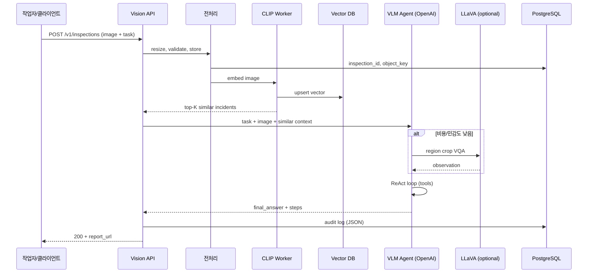

# 생성형 AI 기반 멀티모달 Vision AI 서비스 개발 시나리오

> **예제 도메인**: 제조 현장·물류 창고의 **이미지 기반 안전·품질 점검 서비스**  
> **핵심 모델**: CLIP(검색·분류), LLaVA(오픈 VQA·로컬 추론), OpenAI API(오케스트레이션·고품질 추론)  
> **참고 구현**: 본 저장소의 `vlm_agent/` (ReAct 스타일 VLM 에이전트 예제)

---

## 1. 시나리오 개요

### 1.1 비즈니스 배경

한 물류 센터는 CCTV·작업자 업로드 사진으로 다음을 자동화하려 한다.

| 요구 | 설명 |
|------|------|
| 유사 사고 검색 | 과거 사고 사진과 유사한 현장 이미지를 빠르게 찾기 |
| 객체·위험 탐지 | 안전모 미착용, 통로 적재, 화재 위험 물질 등 자연어 질의 |
| Before/After 비교 | 정리 전·후 사진 비교 리포트 |
| 감사 추적 | 누가·언제·어떤 이미지로·어떤 결론에 도달했는지 기록 |

**목표**: 단일 REST API와 웹 대시보드로 위 기능을 제공하는 **멀티모달 Vision AI 플랫폼**을 12~16주 내 PoC → 파일럿 → 운영 단계로 구축한다.

### 1.2 왜 CLIP + LLaVA + OpenAI인가

```
┌─────────────────────────────────────────────────────────────────┐
│                     사용자 / 외부 시스템                         │
└────────────────────────────┬────────────────────────────────────┘
                             │ REST / WebSocket
┌────────────────────────────▼────────────────────────────────────┐
│              API Gateway + 인증 (JWT / API Key)                  │
└────────────────────────────┬────────────────────────────────────┘
                             │
        ┌────────────────────┼────────────────────┐
        ▼                    ▼                    ▼
┌───────────────┐   ┌─────────────────┐   ┌──────────────────┐
│ CLIP 서비스   │   │ LLaVA 서비스    │   │ OpenAI API       │
│ (임베딩·검색) │   │ (로컬 VQA/GPU)  │   │ (gpt-4o 등)      │
└───────┬───────┘   └────────┬────────┘   └────────┬─────────┘
        │                    │                     │
        └────────────────────┼─────────────────────┘
                             ▼
              ┌──────────────────────────────┐
              │  오케스트레이션 레이어        │
              │  (에이전트·라우팅·캐시)       │
              │  ← vlm_agent ReAct 패턴      │
              └──────────────────────────────┘
                             │
        ┌────────────────────┼────────────────────┐
        ▼                    ▼                    ▼
   Vector DB            Object Storage         PostgreSQL
   (Milvus/Qdrant)      (S3/MinIO)            (메타·감사)
```

| 구성요소 | 역할 | 선택 이유 |
|----------|------|-----------|
| **CLIP** (`openai/clip-vit-large-patch14` 등) | 이미지·텍스트 공동 임베딩, 유사도 검색, zero-shot 라벨 후보 | 빠르고 저렴, 대량 인덱싱에 적합 |
| **LLaVA** (`llava-hf/llava-1.5-7b-hf` 등) | 로컬 GPU에서 상세 VQA, 민감 이미지 외부 전송 최소화 | API 비용·지연·데이터 주권 |
| **OpenAI API** (`gpt-4o`, `text-embedding-3-large`) | 복잡 추론, JSON 구조화, 에이전트 계획, 고품질 최종 답변 | 강한 instruction following, 멀티모달 Chat Completions |

**라우팅 원칙 (예시)**:

- 단순 유사 검색 → CLIP + Vector DB만
- 표준 VQA·영역 확대 → LLaVA (내부망)
- 다단계 추론·도구 호출·최종 리포트 → OpenAI + `vlm_agent` 스타일 ReAct

---

## 2. 시스템 아키텍처 (상세)

### 2.1 논리 계층

1. **수집 계층**: 카메라 RTSP, 모바일 업로드, 배치 ZIP import  
2. **전처리 계층**: 리사이즈, EXIF 제거, 얼굴/번호판 블러(선택), 썸네일 생성  
3. **인퍼런스 계층**: CLIP 임베딩, LLaVA 생성, OpenAI Chat/Vision  
4. **지식 계층**: 벡터 DB, 사고 사례 메타데이터, 프롬프트·정책 버전  
5. **애플리케이션 계층**: 검색 UI, 점검 워크플로, 알림(Slack/이메일)  
6. **거버넌스**: 감사 로그, PII 마스킹, 모델·프롬프트 버전 관리  

### 2.2 데이터 흐름 — 이미지 업로드 ~ 분석



### 2.3 API 설계 (예시)

| Method | Path | 설명 |
|--------|------|------|
| `POST` | `/v1/images` | 이미지 업로드, `image_id` 반환 |
| `POST` | `/v1/embeddings` | CLIP 임베딩 생성 (배치 지원) |
| `POST` | `/v1/search` | 텍스트 또는 이미지로 유사 사례 검색 |
| `POST` | `/v1/inspect` | 자연어 작업 + 이미지 → 에이전트 분석 |
| `GET` | `/v1/inspect/{id}` | 비동기 작업 상태·결과 |
| `POST` | `/v1/compare` | 두 이미지 비교 (에이전트 `compare_images`와 동일 개념) |

**요청 예시 — 점검 생성**

```json
{
  "task": "이미지에 있는 객체를 나열하고 안전 위험 요소가 있으면 알려줘",
  "image_ids": ["img_8f2a1c"],
  "options": {
    "routing": "auto",
    "max_steps": 8,
    "use_similar_incidents": true,
    "report_format": "markdown"
  }
}
```

**응답 예시**

```json
{
  "inspection_id": "insp_9b3d",
  "status": "completed",
  "final_answer": "통로 중앙에 팔레트 2개가 적재되어 있어 ...",
  "similar_incidents": [
    {"id": "inc_2024_0312", "score": 0.89, "summary": "통로 적재 위반"}
  ],
  "steps": [
    {
      "step": 1,
      "thought": "전체 장면에서 통로와 적재물 확인 필요",
      "action": "describe_region",
      "action_input": {"x1": 0.3, "y1": 0.4, "x2": 0.7, "y2": 0.9, "question": "통로를 막는 물체는?"}
    }
  ],
  "report_url": "s3://reports/insp_9b3d.md"
}
```

본 저장소 CLI와의 대응:

```bash
python -m vlm_agent.main \
  --workspace ./workspace \
  --image photo.jpg \
  --task "이미지에 있는 객체를 나열하고 안전 위험 요소가 있으면 알려줘" \
  --output ./logs/run.json
```

---

## 3. 개발 단계별 시나리오 (12~16주)

### Phase 0 — 요구사항·데이터 (1~2주)

**목표**: 측정 가능한 성공 기준 정의

| 활동 | 산출물 |
|------|--------|
| 이해관계자 인터뷰 | 유스케이스 목록, SLA(응답 5초 P95 등) |
| 샘플 데이터 수집 | 라벨 200~500장 (정상/위험/모호) |
| 정책 정의 | 외부 API 전송 금지 이미지 유형, 보존 기간 |
| 벤치마크 질문 세트 | 50개 VQA + 20개 검색 쿼리 |

**예시 성공 지표**

- CLIP 검색 Recall@5 ≥ 0.75 (사고 유형별)
- VQA: 전문가 평가 4점 이상(5점 만점) 비율 ≥ 70%
- OpenAI 호출 1건당 평균 비용 ≤ $0.05 (캐시·라우팅 후)

---

### Phase 1 — CLIP 기반 검색 PoC (2주)

**목표**: “비슷한 사고 사진 찾기”를 벡터 검색으로 구현

#### 1.1 환경

```text
Python 3.11+
torch, transformers, pillow
qdrant-client 또는 pymilvus
```

#### 1.2 구현 스케치

```python
# clip_indexer.py (개념 코드)
from transformers import CLIPProcessor, CLIPModel
import torch

model = CLIPModel.from_pretrained("openai/clip-vit-large-patch14")
processor = CLIPProcessor.from_pretrained("openai/clip-vit-large-patch14")

def embed_image(path: str) -> list[float]:
    image = Image.open(path).convert("RGB")
    inputs = processor(images=image, return_tensors="pt")
    with torch.no_grad():
        vec = model.get_image_features(**inputs)
        vec = vec / vec.norm(dim=-1, keepdim=True)
    return vec[0].tolist()

def embed_text(query: str) -> list[float]:
    inputs = processor(text=[query], return_tensors="pt", padding=True)
    with torch.no_grad():
        vec = model.get_text_features(**inputs)
        vec = vec / vec.norm(dim=-1, keepdim=True)
    return vec[0].tolist()
```

#### 1.3 운영 체크리스트

- [ ] 배치 인덱싱 파이프라인 (야간 cron)
- [ ] 컬렉션 스키마: `incident_id`, `tags`, `captured_at`, `vector`
- [ ] 텍스트↔이미지 교차 검색 API (`POST /v1/search`)
- [ ] 임베딩 버전 필드 (`clip_vit_l14_v1`) — 모델 교체 시 재인덱싱

**시나리오 검증**

1. 작업자가 “안전모 미착용” 텍스트로 검색 → 관련 사진 5건 노출  
2. 신규 현장 사진 업로드 → 이미지 임베딩으로 Top-5 유사 사고 표시  

---

### Phase 2 — LLaVA 로컬 VQA (2~3주)

**목표**: GPU 서버에서 상세 질의응답, OpenAI 호출 전 1차 필터

#### 2.1 배포 옵션

| 옵션 | 장점 | 단점 |
|------|------|------|
| vLLM + LLaVA-1.5-7B | 처리량 높음 | GPU 메모리 16GB+ |
| Hugging Face `pipeline` | 구축 단순 | 동시성 낮음 |
| Ollama (llava) | 로컬 개발 빠름 | 프로덕션 SLA 검증 필요 |

#### 2.2 LLaVA 마이크로서비스 (FastAPI 예시)

```python
# llava_service/main.py (개념)
@app.post("/v1/vqa")
async def vqa(image_url: str, question: str):
    # 이미지 로드 → LLaVA generate
    answer = model.generate(image, question, max_new_tokens=256)
    return {"answer": answer, "model": "llava-1.5-7b-hf"}
```

#### 2.3 CLIP + LLaVA 연동 패턴

1. CLIP으로 후보 라벨 3개 추출 (zero-shot: `"a photo of {label}"` 유사도)  
2. LLaVA에 질문: “다음 후보 중 실제로 보이는 것은? {labels}”  
3. 신뢰도 낮으면 OpenAI로 에스컬레이션  

**시나리오 검증**

- 질문: “통로를 막고 있는 것이 있나?” → LLaVA 단독 응답 시간 P95 < 3초 (A100 1장 기준 목표)  
- 내부망 전용 이미지는 LLaVA만 거치고 로그에 `external_api=false` 기록  

---

### Phase 3 — OpenAI API 오케스트레이션·에이전트 (3주)

**목표**: 본 저장소 `vlm_agent` 패턴을 서비스 코어로 확장

#### 3.1 현재 예제 구조 (이미 구현됨)

| 모듈 | 역할 |
|------|------|
| `vlm_client.py` | OpenAI Chat Completions + base64 이미지 첨부 |
| `agent.py` | ReAct 루프: thought → action → observation |
| `tools.py` | `describe_region`, `compare_images`, `list_images`, `write_report` |
| `config.py` | `OPENAI_API_KEY`, `VLM_MODEL=gpt-4o` |

`VLMClient.chat()`은 OpenAI Vision 호환 메시지 형식을 사용한다:

```python
# 이미지는 data URL로 마지막 user 메시지에 첨부
{"type": "image_url", "image_url": {"url": f"data:{mime};base64,{b64}"}}
```

#### 3.2 확장할 도구 (서비스화 시)

| 신규 도구 | 설명 |
|-----------|------|
| `search_similar` | CLIP Vector DB 조회 → observation에 사고 요약 주입 |
| `clip_classify` | zero-shot 후보 라벨 점수 반환 |
| `llava_ask` | 로컬 LLaVA에 위임 (민감 이미지) |
| `escalate_openai` | 명시적 고비용 추론 (정책 허용 시) |

#### 3.3 ReAct 한 사이클 (실행 예)

**Step 1** — VLM(OpenAI) JSON 출력:

```json
{
  "thought": "통로 중앙에 박스가 보인다. 해당 영역을 확대해 확인한다.",
  "action": "describe_region",
  "action_input": {
    "image_path": "warehouse_aisle.jpg",
    "x1": 0.35, "y1": 0.45, "x2": 0.65, "y2": 0.85,
    "question": "통로를 막는 물체의 종류와 개수는?"
  },
  "answer": ""
}
```

**Step 2** — observation 반영 후:

```json
{
  "thought": "팔레트 2개가 통로를 막고 있음. 유사 사고를 검색해 보고한다.",
  "action": "search_similar",
  "action_input": {"image_path": "warehouse_aisle.jpg", "top_k": 3},
  "answer": ""
}
```

**Step 3** — finish:

```json
{
  "thought": "위험 요소와 유사 사례를 종합했다.",
  "action": "finish",
  "action_input": {},
  "answer": "통로 중앙에 팔레트 2개 적재. 2024-03 사고 사례와 유사. 즉시 이동 권고."
}
```

#### 3.4 OpenAI API 사용 가이드

| 용도 | API | 모델 예 |
|------|-----|---------|
| 에이전트 계획·JSON | Chat Completions + `response_format: json_object` | `gpt-4o` |
| 영역 설명·비교 | Chat Completions (vision) | `gpt-4o-mini` (비용 절감) |
| 텍스트 임베딩 (문서 검색) | Embeddings | `text-embedding-3-large` |
| 대량 단순 분류 | Chat + 짧은 프롬프트 | `gpt-4o-mini` |

**비용·지연 최적화**

- 첫 턴만 이미지 첨부 (`agent.py`의 `image_paths if step_idx == 1`) — 동일 패턴 유지  
- 동일 `image_id` + `task` 해시 → Redis 캐시 24h  
- `max_steps` 기본 8 (`AGENT_MAX_STEPS`) — 무한 루프 방지  

환경 변수 (`.env.example` 기준):

```env
OPENAI_API_KEY=sk-...
OPENAI_BASE_URL=          # Azure OpenAI 등 시 선택
VLM_MODEL=gpt-4o
AGENT_MAX_STEPS=8
```

---

### Phase 4 — API·비동기 작업·대시보드 (2~3주)

**목표**: 동기 CLI를 운영 가능한 서비스로 전환

#### 4.1 기술 스택 (권장)

- **API**: FastAPI + Uvicorn  
- **작업 큐**: Celery + Redis 또는 ARQ  
- **스토리지**: MinIO (S3 호환)  
- **DB**: PostgreSQL (inspection, audit)  
- **프론트**: React + 이미지 오버레이(bbox는 추후 Grounding DINO 등 확장)  

#### 4.2 비동기 점검 플로우

1. `POST /v1/inspect` → `202 Accepted`, `inspection_id`  
2. Worker가 `VLMAgent.run()` 호출  
3. WebSocket 또는 polling으로 진행률 (`step 2/8`)  
4. 완료 시 `write_report` 결과 URL 반환  

#### 4.3 감사 로그 스키마

```sql
CREATE TABLE inspection_audit (
  id UUID PRIMARY KEY,
  inspection_id UUID NOT NULL,
  step INT,
  model_provider TEXT,  -- 'openai' | 'llava' | 'clip'
  model_name TEXT,
  prompt_hash TEXT,
  input_tokens INT,
  output_tokens INT,
  latency_ms INT,
  payload_json JSONB,
  created_at TIMESTAMPTZ DEFAULT now()
);
```

---

### Phase 5 — 평가·안전·컴플라이언스 (2주)

#### 5.1 오프라인 평가

| 태스크 | 지표 |
|--------|------|
| CLIP 검색 | Recall@k, MRR |
| LLaVA VQA | BLEU/ROUGE (참고), **전문가 정확도** (주 지표) |
| 에이전트 end-to-end | 작업 완료율, 평균 step 수, 환각율(샘플링) |

#### 5.2 안전 가드레일

- 프롬프트: “이미지에 없는 객체를 추측하지 말 것” (`SYSTEM_PROMPT` 확장)  
- 도구 출력 길이 제한 (`observation[:500]` 패턴)  
- PII·얼굴 자동 블러 후 외부 API 전송  
- 거부 정책: 의료 진단·법률 확정 표현 금지  

#### 5.3 모델 버전 관리

```text
configs/
  prompts/v1.2.0/system.txt
  routing/v1.0.0/policy.yaml   # CLIP→LLaVA→OpenAI 임계값
```

---

### Phase 6 — 프로덕션 배포·관측 (2주)

#### 6.1 Kubernetes (개념)

```text
deploy/
  clip-deployment.yaml      # CPU, HPA on queue depth
  llava-deployment.yaml     # GPU node pool, 1 model per pod
  api-deployment.yaml
  worker-deployment.yaml
```

#### 6.2 관측 지표

- Prometheus: `inspect_duration_seconds`, `openai_tokens_total`, `clip_search_latency`  
- Grafana 대시보드: 비용/일, GPU 사용률, 실패율  
- 알림: OpenAI 429/5xx 급증, LLaVA OOM  

#### 6.3 재해 복구

- OpenAI 장애 시: LLaVA-only degraded mode (품질 하락 공지)  
- Vector DB 장애 시: 검색 비활성화, VQA만 제공  

---

## 4. 엔드투엔드 사용자 시나리오 (스토리)

### 시나리오 A — 아침 안전 순찰

1. **08:10** 현장 감독이 모바일 앱으로 통로 사진 3장 업로드  
2. 시스템이 CLIP으로 지난달 “통로 적재” 사고 3건을 자동 첨부  
3. OpenAI 에이전트가 각 사진에서 `describe_region`으로 적재물 확인  
4. **08:12** Slack 알림: “창고 B 통로 — 팔레트 적재 위험 (유사 사고 89%)”  
5. 감독이 앱에서 “조치 완료” 후 After 사진 업로드 → `compare_images`로 개선 확인  
6. `write_report`로 일일 리포트 `reports/2026-05-18-shift-a.md` 생성  

### 시나리오 B — 민감 구역 (내부망 전용)

1. 정책: `zone=restricted` 이미지는 OpenAI 호출 금지  
2. 라우터가 LLaVA-only + CLIP 검색만 사용  
3. 감사 로그에 `external_api=false` 기록 → 컴플라이언스 통과  

### 시나리오 C — 대량 과거 사진 마이그레이션

1. 야간 배치: 10만 장 CLIP 임베딩 → Qdrant  
2. 태그 없는 사진에 대해 LLaVA로 1줄 캡션 생성 (배치, 저우선)  
3. 이후 텍스트 검색 품질 향상  

---

## 5. 구현 로드맵 요약

| 주차 | 마일스톤 | 검증 |
|------|----------|------|
| 1~2 | 요구·데이터·벤치마크 | 평가 세트 동결 |
| 3~4 | CLIP 검색 API | Recall@5 목표 달성 |
| 5~7 | LLaVA 서비스 + 라우팅 | 내부망 VQA SLA |
| 8~10 | OpenAI 에이전트 (`vlm_agent` 확장) | E2E 50질문 통과 |
| 11~12 | FastAPI·비동기·UI | 파일럿 사용자 5명 |
| 13~14 | 평가·가드레일 | 환각 샘플 감사 |
| 15~16 | K8s·모니터링·DR | 부하 테스트 |

---

## 6. 리스크와 대응

| 리스크 | 영향 | 대응 |
|--------|------|------|
| VLM 환각 | 잘못된 안전 판단 | 영역 확대·다중 모델 합의·human-in-the-loop |
| OpenAI 비용 | 예산 초과 | mini 모델, 캐시, step 상한, CLIP/LLaVA 선필터 |
| GPU 부족 | LLaVA 지연 | 큐 + autoscale, 작은 모델(7B), 양자화 |
| 데이터 유출 | 규제 위반 | zone 정책, 온프레 AI, EXIF/PII 제거 |
| CLIP 도메인 갭 | 검색 부정확 | 도메인 파인튜닝 또는 OpenCLIP, 재인덱싱 |

---

## 7. 다음 단계 (본 저장소 기준)

1. `vlm_agent/tools.py`에 `search_similar`(CLIP) · `llava_ask` 스텁 추가  
2. `config.py`에 `CLIP_SERVICE_URL`, `LLAVA_SERVICE_URL`, `ROUTING_POLICY` 환경 변수 추가  
3. FastAPI 래퍼 `services/vision_api/` 신설 → `VLMAgent`를 Worker에서 호출  
4. `docs/` 벤치마크 질문 YAML과 오프라인 평가 스크립트 추가  

---

## 부록 A — 참고 모델·리소스

| 이름 | 용도 | 비고 |
|------|------|------|
| `openai/clip-vit-large-patch14` | 임베딩·zero-shot | Hugging Face |
| `llava-hf/llava-1.5-7b-hf` | 이미지 대화 | GPU 권장 |
| OpenAI `gpt-4o` | 에이전트·고품질 VQA | `vlm_agent` 기본 |
| OpenAI `text-embedding-3-large` | 문서·규정 RAG | 선택 |

## 부록 B — 용어

| 용어 | 설명 |
|------|------|
| VLM | Vision-Language Model, 이미지+텍스트 입력 |
| VQA | Visual Question Answering |
| ReAct | Reasoning + Acting, 추론과 도구 호출 반복 |
| Zero-shot | 해당 클래스로 파인튜닝하지 않은 추론 |

---

*문서 버전: 1.0 · 작성 기준: `vlm_agent` 예제 코드베이스*
