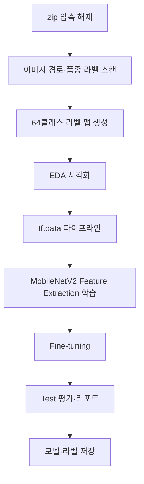

# Fruits360_3body_TransferLearning.ipynb 사용 가이드

본 문서는 `Fruits360_3body_TransferLearning.ipynb` 노트북의 **사용법**, **전체 기능**, **셀별 동작 구조**를 설명합니다.

---

## 1. 개요

| 항목 | 내용 |
|------|------|
| **목적** | Fruits-360 *3-body problem* 데이터로 **품종(variety) 단위** 이미지 분류 모델 학습·평가 |
| **프레임워크** | TensorFlow **2.10** |
| **모델** | MobileNetV2 (ImageNet 사전학습) + 전이학습·미세조정 |
| **입력 데이터** | `fruits-360-3-body-problem.zip` |
| **클래스 정의** | 상위 3종(Apple / Cherry / Tomatoe)이 아닌 **하위 품종 폴더** (`Apple/Apple Braeburn 1` 등) **총 64개** |

### 데이터셋 특성 (반드시 이해할 것)

- **Training**: 48품종, 약 34,800장  
- **Test**: 16품종, 약 12,233장  
- Train과 Test의 **품종 이름이 전혀 겹치지 않음** (교집합 0).

따라서 Test 정확도는 일반적인 “같은 클래스 재현”이 아니라, **학습에 없던 품종에 대한 시각적 일반화** 성능을 뜻합니다. Test 점수가 Validation보다 낮은 것이 정상입니다.

### 디렉터리 구조 (압축 해제 후)

```
fruits-360-3-body-problem/
├── Training/
│   ├── Apple/
│   │   ├── Apple Braeburn 1/
│   │   │   └── *.jpg
│   │   └── ...
│   ├── Cherry/
│   └── Tomatoe/
└── Test/
    └── (동일한 3단계 구조, 다른 품종)
```

---

## 2. 사전 준비

### 2.1 필요 파일

| 파일/폴더 | 위치 | 설명 |
|-----------|------|------|
| `fruits-360-3-body-problem.zip` | 노트북과 **같은 폴더** | 원본 데이터 압축 파일 |
| `Fruits360_3body_TransferLearning.ipynb` | 프로젝트 루트 | 본 노트북 |

### 2.2 Python 환경

- **Python 3.10** 권장 (프로젝트 `.venv` 기준)
- **TensorFlow 2.10.x** (첫 코드 셀에서 버전 검사)
- 주요 패키지: `numpy`, `matplotlib`, `tensorflow`, `scikit-learn`

### 2.3 실행 방법

1. VS Code / Cursor에서 노트북을 연다.
2. 커널을 **`.venv` (TF 2.10)** 로 선택한다.
3. **위에서 아래로 순서대로** 셀을 실행한다. (이전 셀 변수에 의존)
4. GPU가 있으면 학습이 빨라진다. 없으면 CPU로도 동작하나 시간이 길어진다.

### 2.4 조정 가능한 하이퍼파라미터 (셀 1)

| 변수 | 기본값 | 설명 |
|------|--------|------|
| `IMG_SIZE` | 224 | MobileNetV2 입력 크기 |
| `BATCH_SIZE` | 32 | 배치 크기 (GPU 메모리 부족 시 16 등으로 축소) |
| `EPOCHS` | 15 | 1차 학습 최대 epoch (EarlyStopping으로 조기 종료 가능) |
| `FINE_TUNE_AT` | 100 | 미세조정 시 **고정**할 base 레이어 수 |
| `VALIDATION_SPLIT` | 0.15 | Training 중 검증용 비율 |
| `SEED` | 42 | 난수 시드 (재현성) |

### 2.5 실행 후 생성물

```
saved_models/fruits360_3body_varieties/
├── mobilenetv2_varieties.h5    # 학습된 Keras 모델
└── class_to_idx.json           # 품종명 → 인덱스 매핑
```

---

## 3. 전체 처리 흐름



---

## 4. 셀별 동작 구조

노트북은 **총 24개 셀** (마크다운 8 + 코드 16)로 구성됩니다. 아래 **셀 번호**는 노트북에서 위에서부터 0부터 매긴 인덱스입니다.

---

### 셀 0 — 마크다운: 제목·개요

**역할:** 프로젝트 목적, TF 2.10, 64품종 분류, Train/Test 품종 불일치 주의사항을 안내합니다.  
**실행:** 읽기 전용 (코드 실행 없음).

---

### 셀 1 — 코드: 환경 설정·경로·하이퍼파라미터

**역할:**

- `tensorflow`, `keras`, `mobilenet_v2` 등 라이브러리 import
- TF 버전이 `2.10`으로 시작하는지 **assert** 검사
- GPU 장치 목록 출력
- `SEED` 고정 (NumPy, TensorFlow)
- `ROOT`, `ZIP_PATH`, `DATA_DIR`, `TRAIN_DIR`, `TEST_DIR` 경로 정의
- 학습 관련 상수 (`IMG_SIZE`, `BATCH_SIZE`, `EPOCHS` 등) 정의

**출력 예:** TensorFlow 버전, GPU 목록

**다음 셀에 전달하는 변수:** `ROOT`, `ZIP_PATH`, `DATA_DIR`, `TRAIN_DIR`, `TEST_DIR`, `SEED`, `IMG_SIZE`, `BATCH_SIZE`, `EPOCHS`, `FINE_TUNE_AT`, `VALIDATION_SPLIT`, `AUTOTUNE`

---

### 셀 2 — 마크다운: §1 압축 해제

섹션 제목만 표시합니다.

---

### 셀 3 — 코드: 데이터셋 압축 해제

**역할:**

- `extract_dataset()`: `fruits-360-3-body-problem.zip`을 `DATA_DIR`에 풂
- `README.md`가 이미 있으면 **재압축 해제 생략**
- `Training/`, `Test/` 폴더 존재 여부 확인

**오류 시:** zip 파일 경로·파일명 확인

---

### 셀 4 — 마크다운: §2 클래스 스캔

섹션 제목만 표시합니다.

---

### 셀 5 — 코드: 품종 스캔 및 라벨 맵

**역할:**

| 함수/로직 | 설명 |
|-----------|------|
| `variety_key()` | 이미지 경로에서 `Apple/Apple Braeburn 1` 형태 품종 키 추출 |
| `scan_split()` | 폴더를 재귀 탐색해 이미지 경로·품종 키 리스트 생성 |
| `class_to_idx` | 전체 64품종 → 정수 라벨 (0~63) |
| `idx_to_class` | 역매핑 |
| `train_labels`, `test_labels` | 각 이미지의 정수 라벨 |

**출력 예:**

- 전체 품종 클래스 수: 64
- Training 이미지 수·품종 수
- Test 이미지 수·품종 수
- Train/Test 품종 교집합: **0**

**다음 셀에 전달:** `train_paths`, `train_keys`, `test_paths`, `test_keys`, `class_to_idx`, `idx_to_class`, `NUM_CLASSES`, `train_labels`, `test_labels`

---

### 셀 6 — 마크다운: §3 EDA

섹션 제목만 표시합니다.

---

### 셀 7 — 코드: 품종별 이미지 수 분포

**역할:**

- `Counter`로 Train/Test 품종별 이미지 개수 집계
- 막대그래프 2개 (Train / Test, 품종별 개수 **정렬** 후 표시)
- 상위 10개 품종 텍스트 출력

**시각화 라벨:** 영어 (matplotlib 한글 깨짐 방지)

---

### 셀 8 — 코드: 샘플 이미지 그리드

**역할:**

| 함수 | 설명 |
|------|------|
| `load_image()` | 파일 읽기 → `decode_image` → RGB 텐서 |
| `show_samples()` | 무작위 12장을 4열 그리드로 표시, 제목에 품종명 |

**출력:** Training / Test 각각 샘플 그리드 1회

**주의:** `load_image()` 결과를 `.numpy()`로 matplotlib에 넘김 (Tensor → ndarray)

---

### 셀 9 — 코드: 원본 해상도 확인

**역할:**

- 첫 장 이미지 `shape` 출력 (기대: `(100, 100, 3)`)
- 무작위 200장의 (높이, 너비) 분포 상위 5개 출력

**주의:** `sample.shape`는 `TensorShape`이므로 `.numpy()` 대신 `tuple(sample.shape)` 사용

---

### 셀 10 — 마크다운: §4 tf.data 파이프라인

섹션 제목만 표시합니다.

---

### 셀 11 — 코드: 데이터셋·증강·분할

**역할:**

| 함수/로직 | 설명 |
|-----------|------|
| `preprocess()` | 읽기 → 224 리사이즈 → (선택) 증강 → `mobenet_v2.preprocess_input` → one-hot 라벨 |
| `make_dataset()` | `from_tensor_slices` → `map` → `batch` → `prefetch` |
| Train/Val 분할 | Training 전체의 15%를 검증용으로 무작위 분할 |
| `train_ds` | shuffle + augment |
| `val_ds` | 검증 (증강 없음) |
| `test_ds` | Test 전체 (증강 없음) |

**출력 예:** 학습 / 검증 / 테스트 이미지 개수

**다음 셀에 전달:** `train_ds`, `val_ds`, `test_ds`, `tr_paths`, `val_paths` 등

---

### 셀 12 — 마크다운: §5 Transfer Learning

섹션 제목만 표시합니다.

---

### 셀 13 — 코드: 모델 정의

**역할:**

1. `MobileNetV2(include_top=False, weights='imagenet')` 로드
2. `base_model.trainable = False` (1단계: 특징 추출기 고정)
3. `GlobalAveragePooling2D` → `Dropout(0.3)` → `Dense(64, softmax)` 헤드
4. `Adam(lr=1e-3)`, `categorical_crossentropy`, `accuracy`로 compile
5. `model.summary()` 출력

**다음 셀에 전달:** `model`, `base_model`

---

### 셀 14 — 코드: 1차 학습 (Feature Extraction)

**역할:**

- **EarlyStopping**: `val_accuracy` 기준 patience=4, 최적 가중치 복원
- **ReduceLROnPlateau**: `val_loss` 기준 학습률 감소
- `model.fit(train_ds, validation_data=val_ds, epochs=EPOCHS)`
- 학습 곡선(accuracy, loss) 그래프

**참고:** 주석에 RTX 3060 기준 약 8분, EarlyStopping으로 epoch 조기 종료 가능

**다음 셀에 전달:** `history`, 학습된 `model` 가중치

---

### 셀 15 — 코드: Fine-tuning (2차 학습)

**역할:**

1. `base_model.trainable = True`
2. 앞쪽 `FINE_TUNE_AT`개 레이어는 다시 `trainable = False`
3. `Adam(lr=1e-5)`로 재compile
4. `initial_epoch`부터 추가 `fine_tune_epochs`(10)만큼 학습

**의미:** 상위 CNN 블록만 살짝 조정해 품종 분류에 맞게 미세 적응

**다음 셀에 전달:** `history_ft`, 최종 `model`

---

### 셀 16 — 마크다운: §6 Test 평가

섹션 제목만 표시합니다.

---

### 셀 17 — 코드: Test `evaluate`

**역할:**

- `model.evaluate(test_ds)`로 Test loss·accuracy 출력
- 64-class softmax 기준 전체 Test 정확도

---

### 셀 18 — 코드: 분류 리포트

**역할:**

- `model.predict(test_ds)`로 확률·예측 클래스 산출
- Test에만 있는 16품종 인덱스 집합 계산
- `classification_report` (Test 품종만, 16클래스)

**다음 셀에 전달:** `y_true`, `y_pred`, `y_prob`, `labels_sorted`, `test_only_idx`

---

### 셀 19 — 코드: 혼동 행렬

**역할:**

- Test 16품종에 대한 `confusion_matrix` 히트맵
- 축 라벨: 품종명 (영문 경로, 작은 글꼴)

---

### 셀 20 — 코드: Test 예측 샘플 시각화

**역할:**

- Test에서 무작위 12장 선택
- 각 subplot: 정답 품종(T), 예측 품종(P), 맞으면 `O` / 틀리면 `X`

---

### 셀 21 — 마크다운: §7 모델 저장

섹션 제목만 표시합니다.

---

### 셀 22 — 코드: 모델·라벨 저장

**역할:**

- `mobilenetv2_varieties.h5` 저장 (TF 2.10 호환 `.h5` 형식)
- `class_to_idx.json` 저장 (추론 시 라벨 해석용)

---

### 셀 23 — 코드: 빈 셀

사용자 메모·추가 실험용 빈 셀입니다.

---

## 5. 주요 함수·데이터 의존 관계

```
셀 1 (설정)
  └─► 셀 3 (압축 해제)
        └─► 셀 5 (스캔) ──► 셀 7, 8, 9 (EDA)
              └─► 셀 11 (Dataset)
                    └─► 셀 13 (모델)
                          └─► 셀 14 (학습) ──► 셀 15 (Fine-tune)
                                └─► 셀 17~20 (평가)
                                      └─► 셀 22 (저장)
```

**셀 8의 `load_image`는 셀 9, 20에서도 재사용됩니다.**  
**셀 18 이후 셀 19, 20은 `y_pred`, `labels_sorted`가 필요하므로 18번을 먼저 실행해야 합니다.**

---

## 6. 자주 발생하는 오류

| 증상 | 원인 | 해결 |
|------|------|------|
| `ModuleNotFoundError: tensorflow` | 잘못된 커널 | `.venv` (TF 2.10) 커널 선택 |
| assert TF 2.10 실패 | 다른 TF 버전 | `pip install tensorflow==2.10.0` 등으로 맞춤 |
| zip 파일 없음 | 경로 불일치 | zip을 노트북과 **동일 폴더**에 배치 |
| `'TensorShape' object has no attribute 'numpy'` | shape에 `.numpy()` 호출 | `tuple(tensor.shape)` 사용 (셀 9는 수정 완료) |
| matplotlib 한글 깨짐 | Windows 기본 폰트 | 그래프 제목·축은 **영어** 사용 (EDA 셀 반영됨) |
| GPU OOM | 배치·이미지 크기 과다 | `BATCH_SIZE` 축소 (예: 16) |
| Test accuracy 매우 낮음 | 품종 불일치 설계 | 데이터셋 특성상 정상; Validation과 혼동하지 말 것 |

---

## 7. 저장 모델 재사용 예시

```python
import json
import tensorflow as tf
from pathlib import Path

save_dir = Path('saved_models/fruits360_3body_varieties')
model = tf.keras.models.load_model(save_dir / 'mobilenetv2_varieties.h5')
with open(save_dir / 'class_to_idx.json', encoding='utf-8') as f:
    class_to_idx = json.load(f)
idx_to_class = {v: k for k, v in class_to_idx.items()}

# 추론 시 전처리는 학습과 동일하게 mobilenet_v2.preprocess_input + 224 리사이즈 필요
```

---

## 8. 라이선스·인용

- 데이터셋: [Fruits-360 3-body problem](https://github.com/fruits-360) — **CC BY-SA 4.0**
- 인용: Mihai Oltean, Fruits-360 dataset, 2017-.

---

## 9. 관련 파일

| 파일 | 설명 |
|------|------|
| `Fruits360_3body_TransferLearning.ipynb` | 본 노트북 |
| `fruits-360-3-body-problem.zip` | 원본 데이터 |
| `fruits-360-3-body-problem/` | 압축 해제 폴더 |
| `saved_models/fruits360_3body_varieties/` | 학습 결과 |

---

*문서 버전: 노트북 구조 기준 (2026)*
