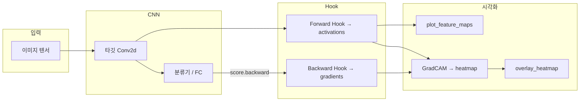

# `07_Heatmap_Grad_CAM.ipynb` 기능 문서

## 1. 문서 목적

이 문서는 `07_Heatmap_Grad_CAM.ipynb`에 구현된 **CNN 해석(Interpretability)** 코드의 기능을 단계별로 설명합니다.

노트북의 핵심 목표는 다음과 같습니다.

- PyTorch **Forward / Backward Hook**으로 Conv 레이어의 **Feature Map(활성값)** 과 **Gradient** 추출
- **Feature Map 시각화**로 필터별 응답 패턴 확인
- **Grad-CAM**으로 “모델이 어떤 공간 영역을 보고 해당 클래스를 예측했는지” Heatmap으로 표현
- 동일 유틸을 **직접 학습한 MNIST CNN**과 **사전학습 ResNet18(ImageNet)** 에 재사용

---

## 2. 전체 구성 요약

| 섹션 | 내용 | 주요 산출물 |
|------|------|-------------|
| 1 | 환경 설정 (PyTorch, device) | CUDA/CPU 확인 |
| 2 | Hook + Grad-CAM 유틸 | `ConvActivationGradient`, `GradCAM`, 시각화 함수 |
| 3 | MNIST CNN 정의 + 짧은 학습 | `MNISTCNN`, 학습된 `conv3` 가중치 |
| 4 | Feature Map 시각화 | Forward Hook만 사용한 채널 grid |
| 5 | Grad-CAM Heatmap | 역전파 + overlay 이미지 |
| 6 | (선택) ResNet18 + ImageNet | Transfer 모델 Grad-CAM |



---

## 3. CNN 해석 방법 비교 (노트북 서두)

노트북에서 언급하는 대표적 해석 기법과 본 예제의 위치는 다음과 같습니다.

| 방법 | 설명 | 본 노트북 |
|------|------|-----------|
| Feature Map Visualization | Conv 출력 채널을 이미지처럼 표시 | **섹션 4** |
| CAM | GAP 직전 feature × FC 가중치 | 개념만 소개 (미구현) |
| **Grad-CAM** | feature gradient로 채널 가중치 계산 후 heatmap | **섹션 2, 5, 6** |
| Attention Visualization | ViT self-attention map | 개념만 소개 (미구현) |

**Grad-CAM 수식 (요약)**

- 타깃 Conv feature map: \(A^k\), 목표 클래스 \(c\)의 logit \(y^c\)
- 채널 가중치: \(\alpha_k^c = \frac{1}{Z}\sum_i\sum_j \frac{\partial y^c}{\partial A_{ij}^k}\) (구현에서는 공간 평균 `grads.mean(dim=(1,2))`)
- Heatmap: \(L^c = \mathrm{ReLU}\left(\sum_k \alpha_k^c A^k\right)\), 이후 min-max로 \([0,1]\) 정규화
- 원본 이미지 크기로 리사이즈 후 `overlay_heatmap`으로 합성

---

## 4. 섹션 1 — 환경 설정

### 4.1 Import

| 패키지 | 용도 |
|--------|------|
| `torch`, `torch.nn`, `F`, `optim` | 모델, Hook, Grad-CAM, 학습 |
| `DataLoader`, `datasets`, `models`, `transforms` | MNIST / ResNet / 전처리 |
| `make_grid` | Feature map 채널을 하나의 grid 이미지로 배치 |
| `matplotlib.pyplot` | 입력·heatmap·overlay 표시 |
| `numpy` | CAM·overlay용 배열 변환 |

### 4.2 Device

```python
device = torch.device('cuda' if torch.cuda.is_available() else 'cpu')
```

이후 모델·입력 텐서는 `device`로 이동합니다. Grad-CAM 내부에서도 `x.to(next(model.parameters()).device)`로 모델과 동일 장치를 맞춥니다.

---

## 5. 섹션 2 — Hook + Grad-CAM 유틸

### 5.1 `ConvActivationGradient`

**역할:** 지정한 `nn.Module`(보통 `nn.Conv2d`) 한 곳에 Hook을 등록해, forward 시 **activation**, backward 시 **gradient**를 저장합니다.

| 멤버 / 메서드 | 설명 |
|---------------|------|
| `activations` | Forward 직후 Conv 출력, shape `(N, C, H, W)`, `detach()` 저장 |
| `gradients` | `grad_output[0]` = \(\partial L / \partial A\), 동일 shape |
| `register_forward_hook` | `_forward_hook`에서 `activations` 갱신 |
| `register_full_backward_hook` | `_backward_hook`에서 `gradients` 갱신 |
| `release()` | Hook handle 제거 — **셀 재실행 시 중복 등록 방지 필수** |

**설계 포인트**

- `detach()`로 저장해 시각화·CAM 계산이 학습 그래프를 이어가지 않게 함
- Feature Map만 볼 때는 forward만 실행하고 backward는 생략 가능 (섹션 4)

### 5.2 `GradCAM`

**역할:** Grad-CAM 파이프라인을 한 번의 `__call__`로 수행합니다.

**처리 순서**

1. `model.zero_grad(set_to_none=True)` — 이전 gradient 초기화  
2. **Forward** — `logits = model(x)` → Hook에 `activations` 저장  
3. **클래스 선택** — `class_idx`가 `None`이면 `logits.argmax(dim=1)`  
4. **Backward** — `score = logits[0, class_idx]; score.backward()` → Hook에 `gradients` 저장  
5. **CAM 계산** (배치 0번만)  
   - `weights = grads.mean(dim=(1, 2))` → 채널별 \(\alpha_k\)  
   - `cam = (weights[:, None, None] * acts).sum(dim=0)`  
   - `F.relu(cam)` — 음수 제거  
   - CPU numpy로 min-max 정규화 `[0, 1]`  
6. 반환: `(cam, class_idx, logits.detach().cpu())`

**메서드**

- `release()` — 내부 `collector.release()` 호출

### 5.3 `find_last_conv(module)`

- `module.modules()`를 순회하며 **마지막** `nn.Conv2d` 반환  
- Grad-CAM은 보통 **분류기 직전** Conv에 적용 (고수준 semantic feature)  
- Conv가 없으면 `ValueError` 발생  

※ 본 노트북 MNIST 예제는 `model.conv3`를 **이름으로 직접** 지정합니다.

### 5.4 `overlay_heatmap(rgb_or_gray, heatmap, alpha=0.45)`

**역할:** 원본 이미지와 Grad-CAM heatmap을 알파 블렌딩합니다.

| 단계 | 내용 |
|------|------|
| 채널 처리 | 2D grayscale이면 RGB 3채널로 `stack` |
| 스케일 | `max <= 1.0`이면 `×255` → `uint8` |
| 리사이즈 | `cv2.resize(heatmap, (w, h))` — CAM은 Conv 해상도이므로 원본 크기에 맞춤 |
| 컬러맵 | `COLORMAP_JET` 적용 후 BGR→RGB |
| 블렌딩 | `alpha * colored + (1-alpha) * base` |

**의존성:** `opencv-python` (없으면 섹션 5 셀에서 `pip install opencv-python-headless` 시도)

### 5.5 `plot_feature_maps(tensor_4d, max_channels=16, title=...)`

**역할:** Conv 출력의 채널 일부를 grid로 묶어 matplotlib에 표시합니다.

| 단계 | 내용 |
|------|------|
| 배치 제거 | 4D `(N,C,H,W)`이면 `[0]` → `(C,H,W)` |
| 채널 선택 | 상위 `max_channels`개 |
| Shape 보정 | `(N,1,H,W)`로 `unsqueeze(1)` — 3D만 넣으면 `make_grid`가 RGB **한 장**으로 오해 |
| 정규화 | 채널·공간별 `amin/amax` on `(H,W)` — 채널마다 스케일 차이 보정 |
| Grid | `make_grid(..., nrow=ceil(sqrt(c)))` |
| 표시 | 최신 torchvision은 grid가 `(3,H,W)`일 수 있음 → **`grid[0]`** 만 `imshow(..., cmap='viridis')` |

---

## 6. 섹션 3 — MNIST CNN

### 6.1 `MNISTCNN` 구조

**설계 의도:** `features`(Conv 스택)와 `classifier`(FC)를 분리해, Grad-CAM 타깃 `conv3`를 속성으로 직접 참조합니다.

| 레이어 | 입출력 (개념) | 비고 |
|--------|----------------|------|
| `conv1` | 1→32, 28×28, pad=1 | + ReLU + MaxPool → 14×14 |
| `conv2` | 32→64, 14×14 | + ReLU + MaxPool → 7×7 |
| `conv3` | 64→128, 7×7 | + ReLU + MaxPool → **3×3**, **Grad-CAM 타깃** |
| `classifier` | Flatten → Linear(1152→128) → ReLU → Dropout(0.3) → Linear(128→10) | 128×3×3 = 1152 |

### 6.2 데이터

- `datasets.MNIST('./data', ...)`, `download=True`
- 전처리: `ToTensor()` + `Normalize((0.1307,), (0.3081,))`
- `train_loader` / `test_loader`: `batch_size=128`, train만 `shuffle=True`

### 6.3 학습 (`train_one_epoch` + 루프)

| 항목 | 값 |
|------|-----|
| Optimizer | Adam, `lr=1e-3` |
| Loss | `CrossEntropyLoss` |
| Epochs | `EPOCHS = 2` (데모용, heatmap 품질↑ 시 3~5 권장) |
| 학습 후 | `model.eval()` — Dropout 고정, Grad-CAM·추론 일관성 |

**`train_one_epoch`**

- `model.train()`, 배치별 forward → loss → backward → step  
- 반환: epoch 평균 `loss`, `accuracy` (샘플 수 가중)

---

## 7. 섹션 4 — Feature Map Visualization

**목적:** Backward 없이 **Forward Hook만**으로 `conv3` 출력을 확인합니다.

**실행 흐름**

1. `test_loader`에서 이미지 1장, `img = images[0:1].to(device)`  
2. `ConvActivationGradient(model.conv3)` 생성  
3. `torch.no_grad()` 안에서 `model(img)` → `collector.activations` 저장  
4. 정규화 역변환으로 grayscale 입력 표시 (`×0.3081 + 0.1307`)  
5. `plot_feature_maps(collector.activations, max_channels=16)`  
6. **`collector.release()`** — Hook 해제  

**`activations` shape 예:** `(1, 128, 3, 3)` — 배치 1, 128채널, 3×3 spatial

---

## 8. 섹션 5 — Grad-CAM Heatmap (MNIST)

**실행 흐름**

1. (필요 시) `cv2` import / 자동 설치  
2. `grad_cam = GradCAM(model, target_layer=model.conv3)`, `model.eval()`  
3. 섹션 4와 **동일한 `img`** 로 `heatmap, pred_class, logits = grad_cam(img)`  
4. softmax 확률 출력, `overlay_heatmap(raw, heatmap)`  
5. 3열 subplot: Original | Grad-CAM jet | Overlay  
6. **`grad_cam.release()`**  

**해석**

- `pred_class`: argmax 예측 (또는 `class_idx` 인자로 특정 클래스 지정 가능)  
- Heatmap 밝은 영역: 해당 클래스 score에 **기여도가 큰** 공간 위치 (conv3 해상도 기준)

---

## 9. 섹션 6 — (선택) ResNet18 + ImageNet

**목적:** 섹션 2의 `GradCAM` 클래스를 **수정 없이** 사전학습 모델에 적용합니다.

### 9.1 `load_rgb_sample_image(size=224)`

이미지 로딩 우선순위:

1. `./data/grad_cam_sample.jpg` 또는 `.png` (사용자 제공)  
2. PyTorch Hub `dog.jpg` URL 다운로드 → `./data/grad_cam_sample_dog.jpg`  
3. 실패 시 **CIFAR-10** 테스트 샘플 인덱스 7 (`cifar[7]`)

### 9.2 ResNet18 설정

| 항목 | 내용 |
|------|------|
| 가중치 | `ResNet18_Weights.IMAGENET1K_V1` |
| 전처리 | Resize 224, ImageNet mean/std |
| 타깃 Conv | `resnet.layer4[-1].conv2` (마지막 stage의 두 번째 conv) |
| 표시용 이미지 | PIL resize 후 `/255.0` numpy RGB |

### 9.3 실행

- `GradCAM(resnet, target_layer=target_conv)`  
- `weights.meta['categories'][pred_rn]`으로 클래스명 표시  
- MNIST와 동일하게 3열 시각화 후 `cam_engine.release()`

---

## 10. 주요 클래스·함수 역할 정리

| 이름 | 종류 | 역할 |
|------|------|------|
| `ConvActivationGradient` | 클래스 | 단일 Conv에 forward/backward Hook, activation·gradient 저장 |
| `GradCAM` | 클래스 | Forward → backward → CAM 계산 일괄 처리 |
| `find_last_conv` | 함수 | 모델에서 마지막 Conv2d 탐색 |
| `overlay_heatmap` | 함수 | CAM을 원본 크기로 리사이즈·컬러맵·블렌딩 |
| `plot_feature_maps` | 함수 | 채널 grid 시각화 |
| `MNISTCNN` | 모델 | MNIST용 3단 Conv + FC |
| `train_one_epoch` | 함수 | 1 epoch 학습 집계 |
| `load_rgb_sample_image` | 함수 | ResNet 데모용 RGB PIL 이미지 로딩 |

---

## 11. 데이터·텐서 흐름 (MNIST Grad-CAM)

```
test_loader batch
    → img (1,1,28,28) normalized
        → model.features … → conv3 output (1,128,3,3)  [Hook: activations]
        → classifier → logits (1,10)
            → score = logits[0, pred_class]
            → backward → gradients (1,128,3,3)       [Hook: gradients]
                → weights (128,) = mean over H,W per channel
                → cam (3,3) → normalize → resize in overlay → (28,28)
```

---

## 12. 실행 산출물

| 유형 | 내용 |
|------|------|
| 콘솔 | PyTorch 버전, device, epoch loss/acc, 타깃 Conv 정보, 예측 클래스·확률 |
| 그림 | 입력 MNIST / Feature map grid / Grad-CAM 3-panel / (선택) ResNet 3-panel |
| 파일 (자동) | `./data` MNIST, (선택) Hub dog 이미지, CIFAR-10 다운로드 |

모델 가중치를 별도 `.pth`로 저장하는 코드는 **포함되어 있지 않습니다** (노트북 세션 메모리 내 학습).

---

## 13. 사용 시 유의사항

### 13.1 Hook 생명주기

- `ConvActivationGradient` / `GradCAM` 사용 후 **반드시 `release()`**  
- 해제하지 않으면 셀 재실행 시 Hook이 중복 등록되어 activation·gradient가 꼬일 수 있음  

### 13.2 `model.eval()`

- Grad-CAM·Feature Map 추론 전 `eval()` — Dropout 랜덤성 제거  
- 학습 루프에서는 `train()` 유지  

### 13.3 Grad-CAM backward

- `score.backward()` 시 **그래프 필요** — Feature Map만 볼 때는 `no_grad()` + forward만  
- 배치 크기 1 가정 (`logits[0, class_idx]`, `activations[0]`)  

### 13.4 타깃 레이어 선택

- 너무 앞쪽 Conv: 저수준 edge/texture, heatmap이 산만할 수 있음  
- 보통 **마지막 Conv** (`conv3`, `layer4[-1].conv2`) 권장  
- `find_last_conv()`는 ResNet 등에서 자동 탐색 시 유용  

### 13.5 `plot_feature_maps` / `make_grid`

- 입력은 반드시 `(N, 1, H, W)` 형태로 맞출 것  
- 최신 `torchvision`의 `make_grid` 출력이 `(3, H, W)`일 수 있음 → **`grid[0]`** 로 2D grayscale 표시  

### 13.6 OpenCV

- `overlay_heatmap`은 `cv2` 필요  
- 서버/헤드리스 환경에서는 `opencv-python-headless` 사용  

### 13.7 학습 epoch

- 기본 `EPOCHS=2`는 데모용  
- 해석 품질을 높이려면 3~5 epoch 이상 학습 권장  

---

## 14. 의존성

| 패키지 | 용도 |
|--------|------|
| torch, torchvision | 모델, Hook, 데이터, make_grid |
| numpy | CAM·이미지 배열 |
| matplotlib | 시각화 |
| opencv-python (headless 가능) | resize, colormap, overlay |
| Pillow | ResNet 샘플 이미지 로딩 |

---

## 15. 확장 아이디어

- `class_idx`를 수동 지정해 **오분류·특정 클래스**에 대한 CAM 비교  
- `GradCAM++`, `Score-CAM` 등으로 가중치 계산만 교체  
- ViT는 Conv 대신 **attention rollout** 등 별도 경로 필요 (노트북 서두 표 참고)  
- 배치 CAM: 루프로 `img[i:i+1]` 처리 및 `release()` 유지  

---

## 16. 결론

`07_Heatmap_Grad_CAM.ipynb`는 PyTorch Hook과 Autograd를 이용해 **CNN 내부를 “볼 수 있게”** 만드는 실습 예제입니다.

1. **Forward hook** → Feature Map으로 필터 응답 확인  
2. **Backward hook + Grad-CAM** → 클래스별 공간 기여도 heatmap  
3. **동일 `GradCAM` 클래스** → MNIST 자체 학습 모델과 ResNet18 전이 학습 모델에 공통 적용  

CAM이 FC–GAP 구조에 묶인 반면, Grad-CAM은 **임의 CNN**에 적용 가능하다는 점이 실무·연구에서 널리 쓰이는 이유이며, 본 노트북은 그 최소 구현과 시각화 파이프라인을 한 파일에서 확인할 수 있게 구성되어 있습니다.
