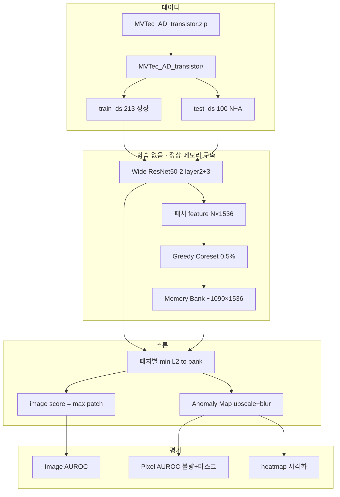

# `09_MVTec_AD_PatchCore_Transistor.ipynb` 기능 문서

## 1. 문서 목적

이 문서는 `09_MVTec_AD_PatchCore_Transistor.ipynb`에 구현된 **MVTec AD transistor 카테고리 + PatchCore 이상 탐지 PoC**의 기능·알고리즘·데이터 흐름·함수 명세·관련 논문을 정리합니다.

노트북의 핵심 목표는 다음과 같습니다.

- 로컬 **`MVTec_AD_transistor.zip`** 으로 **비지도 이상 탐지** 파이프라인을 재현한다.
- 사전학습 **Wide ResNet50-2**에서 **패치 단위 특징**을 추출한다.
- train 정상 패치만으로 **Coreset Memory Bank**를 구축한다.
- test 이미지에 대해 **최근접 이웃(NN) 거리**로 image/pixel 점수와 **Anomaly Map**을 산출한다.
- **Image-level / Pixel-level AUROC** 및 시각화로 PoC 성능을 확인한다.

> **PoC(Proof of Concept)**  
> 배포 전 “PatchCore + MVTec transistor에서 탐지·위치 추정이 동작하는지”를 검증하는 실험 노트북입니다. 논문 전체 재현(다중 백본·앙상블·최적 하이퍼)보다 **교육·데모·베이스라인**에 가깝습니다.

---

## 2. 관련 논문 및 요지

### 2.1 PatchCore (본 노트북 알고리즘의 근거)

| 항목 | 내용 |
|------|------|
| **제목** | Towards Total Recall in Industrial Anomaly Detection |
| **저자** | Karsten Roth, Latha Pemula, Joaquin Zepeda, Bernhard Schölkopf, Thomas Brox, Peter Gehler |
| **학회** | CVPR 2022 |
| **arXiv** | [https://arxiv.org/abs/2106.08265](https://arxiv.org/abs/2106.08265) |
| **공식 코드** | [https://github.com/amazon-science/patchcore-inspection](https://github.com/amazon-science/patchcore-inspection) |

**요지 (한 줄)**  
정상 train 이미지의 **CNN 패치 임베딩**만으로 메모리 뱅크를 만들고, test 패치와의 **최근접 이웃 거리**로 이상 점수·위치를 얻어 MVTec AD에서 **높은 재현율(total recall)** 을 달성한다.

**핵심 아이디어**

1. **백본**: ImageNet 사전학습 CNN(논문·공식 구현: Wide ResNet-50-2 등)의 **중간 레이어** 특징을 패치별 벡터로 사용. Fine-tuning 없이도 산업 결함에 일반화되는 표현을 활용.
2. **Memory Bank**: train **정상** 이미지에서 추출한 모든 패치(또는 그 부분집합)를 저장. test 시 “정상 메모리와 멀리 떨어진 패치”를 이상으로 본다.
3. **Coreset subsampling**: 패치 수가 수십만~백만 단위이므로, **greedy coreset**으로 대표 패치만 남겨 뱅크 크기·추론 비용을 줄인다(논문 Appendix의 approximate greedy 방식).
4. **Scoring**: 각 test 패치에 대해 뱅크 내 **최소 Euclidean 거리**를 이상 점수로 사용. 이미지 점수는 보통 패치 점수의 **max**(가장 이상한 위치).
5. **Localization**: 패치 격자 점수를 업샘플·스무딩해 **Anomaly heatmap** 생성(논문은 추가로 local neighborhood aggregation 등을 사용; 본 PoC는 bilinear + Gaussian blur).

**본 노트북과 논문의 차이 (간략)**

| 항목 | 논문/공식 PatchCore | 본 노트북 PoC |
|------|---------------------|---------------|
| 입력 해상도 | 구현·카테고리별 상이 | **256×256** 고정 |
| Coreset 비율 | 약 **10%** 등 | **0.5%** + 상한 **1200** (실행 시간 절충) |
| 백본 | WideResNet + 옵션 앙상블 | **Wide ResNet50-2, layer2+layer3** |
| 위치 정제 | Neighborhood aggregation 등 | **bilinear 업샘플 + Gaussian(σ=4)** |
| 데이터 | MVTec 전 카테고리 | **transistor** 단일 + **로컬 zip** |

---

### 2.2 MVTec AD (데이터셋·평가 프로토콜)

| 항목 | 내용 |
|------|------|
| **제목** | MVTec AD — A Comprehensive Real-World Dataset for Unsupervised Anomaly Detection |
| **저자** | Paul Bergmann, Michael Faessler, Lukas Ball, Klaus-Robert Müller, Carsten Stege, Thomas Brox |
| **arXiv** | [https://arxiv.org/abs/1901.11404](https://arxiv.org/abs/1901.11404) |
| **데이터셋 페이지** | [https://www.mvtec.com/company/research/datasets/mvtec-ad](https://www.mvtec.com/company/research/datasets/mvtec-ad) |

**요지 (한 줄)**  
실제 산업 부품·직물 이미지에 **다양한 결함**을 포함한 벤치마크로, train에는 **정상만**, test에는 **정상+불량**을 두고 **이미지/픽셀 단위** 이상 탐지 성능을 비교한다.

**핵심 규칙 (본 노트북이 따르는 가정)**

| Split | 내용 |
|-------|------|
| `train` | **정상(`good`)만** — 결함 라벨 없음 |
| `test` | 정상 + **여러 결함 유형** (폴더명 = defect type) |
| `ground_truth` | 불량 test에 대한 **픽셀 마스크** (평가용) |

**transistor 카테고리 (본 PoC 로드 결과)**

| Split | 장수 | 구성 |
|-------|------|------|
| `train` | **213** | 전부 정상 |
| `test` | **100** | 정상 **60** + 불량 **40** (마스크 40) |

불량 유형 예: `bent_lead`, `cut_lead`, `damaged_case`, `misplaced` 등 (폴더명이 `defect_type`으로 기록됨).

---

### 2.3 참고: 사전학습 백본 (Wide ResNet)

PatchCore는 **ImageNet 사전학습** 특징을 그대로 사용합니다. Wide ResNet-50-2는 ResNet보다 채널이 넓은 variant로, PatchCore 공식 구현에서 자주 쓰이는 백본입니다.

- **torchvision**: `wide_resnet50_2(weights=Wide_ResNet50_2_Weights.IMAGENET1K_V1)`
- ImageNet 분류 사전학습 가중치로 **일반 텍스처·형태** 표현을 얻고, 산업 이미지 패치에 **전이**합니다.

---

## 3. 전체 구성 요약

| 섹션 | 제목 | 주요 내용 | 산출물 |
|------|------|-----------|--------|
| 1 | 환경 설정 | Colab/로컬, import, `device`, 한글 폰트, 시드 | `IN_COLAB`, `device`, `RNG` |
| 2 | MVTec 로드 | zip 해제, HF `Dataset` | `train_ds`, `test_ds` |
| 3 | EDA | 메타 통계, 분포 차트, 샘플 그리드 | `meta_train`, `meta_test` |
| 4 | PatchCore | 백본, 패치 feature, coreset, NN, map | `memory_bank`, `train_features` |
| 5 | Test | 추론, AUROC, heatmap 예시 | `image_scores`, `pred_maps`, AUC |



---

## 4. 문제 정의

### 4.1 산업 이상 탐지 관점

| 가정 | 설명 |
|------|------|
| train | **정상 이미지만** (transistor `train/good`) |
| test | 정상 + **미지의 결함 유형** 혼합 |
| 학습 | **파라미터 업데이트 없음** (백본 frozen) |
| 목표 | test에서 **이상 이미지 탐지** + (가능하면) **결함 위치** 히트맵 |

### 4.2 PatchCore vs 08번 ViT PoC (동일 프로젝트 내 비교)

| 항목 | `08` ViT PoC | `09` PatchCore PoC |
|------|--------------|-------------------|
| 백본 | ViT-Base (HF) | Wide ResNet50-2 (torchvision) |
| 표현 단위 | **이미지** 임베딩 768-d | **패치** 임베딩 1536-d |
| 정상 모델 | 프로토타입 / k-NN on **이미지** | k-NN on **패치 뱅크** |
| 위치 정보 | 약함 (이미지 수준) | **Anomaly Map** (패치 격자) |
| 데이터 | capsule (Hub tar) | transistor (**로컬 zip**) |
| 카테고리 | capsule | transistor |

---

## 5. 의존성 및 실행 환경

### 5.1 권장 패키지

| 패키지 | 용도 |
|--------|------|
| `torch`, `torchvision` | ResNet 백본, `cdist`, conv |
| `datasets` | `Dataset`, `Features`, `HFImage` |
| `PIL` | 이미지·마스크 I/O |
| `numpy` | 점수·마스크 배열 |
| `sklearn` | `roc_auc_score`, `roc_curve` |
| `matplotlib`, `seaborn` | EDA·ROC·히트맵 |

로컬 설치 (노트북 주석):

```bash
py -3.11 -m pip install torch torchvision scikit-learn seaborn datasets pillow matplotlib
```

### 5.2 전역 변수

| 변수 | 설명 |
|------|------|
| `device` | `cuda` 또는 `cpu` — feature 추출·coreset·NN |
| `RNG` | `np.random.default_rng(42)` — coreset 첫 인덱스 등 |
| `torch.manual_seed(42)` | PyTorch 시드 |
| `IN_COLAB` | Colab 여부 (zip 업로드 분기용) |

### 5.3 import 충돌 주의

```python
from datasets import Image as HFImage   # Dataset feature
from PIL import Image                   # PIL
```

`datasets.Image`와 `PIL.Image`를 동시에 `Image`로 쓰면 `HFImage()` 호출 시 **TypeError**가 납니다.

### 5.4 실행 순서 (필수)

1. §1 import 셀 → `device`, `RNG`
2. **§2 데이터 로드** → `train_ds`, `test_ds` (**EDA·PatchCore보다 먼저**)
3. §3 EDA (선택)
4. §4 PatchCore (순서대로: 백본 → 패치 추출 → coreset → NN 유틸)
5. §5 Test

§2를 건너뛰면 `NameError: train_ds` / `train_features`가 발생합니다.

---

## 6. 섹션 2 — MVTec AD 로컬 로드

### 6.1 경로 상수

| 변수 | 기본값 | 설명 |
|------|--------|------|
| `WORK_DIR` | `Path.cwd()` | 노트북 실행 디렉터리 |
| `MVTEC_ZIP` | `WORK_DIR / 'MVTec_AD_transistor.zip'` | 압축 파일 |
| `MVTEC_ROOT` | `WORK_DIR / 'MVTec_AD_transistor'` | 해제 폴더 |
| `LABEL_NAMES` | `{0: 'normal', 1: 'abnormal'}` | 표시용 |

### 6.2 `resolve_mvtec_root(base)`

`train/good` 디렉터리가 있는 **transistor 루트**를 탐색합니다.

- 후보: `base`, `base/transistor`, `base/MVTec_AD_transistor`
- 실패 시 `rglob`로 유일한 `train/good` 경로 탐색

### 6.3 `ensure_mvtec_data() -> Path`

1. `MVTEC_ROOT`가 이미 있으면 → `resolve_mvtec_root` 반환  
2. 없으면 `MVTEC_ZIP`을 `WORK_DIR`에 **zipfile.extractall**  
3. 해제 후 다시 `resolve_mvtec_root`

zip·폴더 모두 없으면 `FileNotFoundError`.

### 6.4 `load_mvtec_local(category_dir) -> dict[str, Dataset]`

**폴더 구조 (MVTec 표준)**

```
transistor/
  train/good/*.png
  test/good/*.png
  test/<defect_type>/*.png
  ground_truth/<defect_type>/*_mask.png
```

**`_split_records(split_name)`**

- `category_dir.rglob('*.png')` 순회, 상대경로 3단계 (`split/defect/file`)만 사용
- `ground_truth` → 마스크 경로 목록
- 그 외 → `image`, `label`(good=0), `defect_type`, `mask_path=''`
- test 불량과 마스크 **개수·stem 매칭** 검증 후 `mask_path` 채움

**Features**

| 필드 | 타입 |
|------|------|
| `image` | `HFImage()` (경로 문자열) |
| `label` | `ClassLabel(['normal','abnormal'])` |
| `defect_type` | `Value('string')` |
| `mask_path` | `Value('string')` |

**출력**

```python
train_ds = ds['train']
test_ds = ds['test']
```

---

## 7. 섹션 3 — EDA

### 7.1 `row_to_pil(row, key='image')`

Dataset 행의 `image` 또는 `mask_path` 파일을 **RGB PIL**로 변환.

### 7.2 `collect_meta(split_ds)`

전체 인덱스를 순회해 `labels`, `defects`, `sizes`, `has_mask` 리스트 반환.

### 7.3 시각화

- **Bar chart**: train vs test 정상/불량 개수
- **Barh**: test 불량 `defect_type` 빈도
- **`show_grid`**: train 정상 6장 + test 정상/불량 샘플

---

## 8. 섹션 4 — PatchCore 구현

### 8.1 하이퍼파라미터

| 변수 | 값 | 설명 |
|------|-----|------|
| `INPUT_SIZE` | `(256, 256)` | Resize·마스크 크기 |
| `BATCH_SIZE` | `8` | train 패치 추출 배치 |
| `CORESET_RATIO` | `0.005` | train 패치의 0.5% → 약 1,090개 |
| `MAX_CORESET_SIZE` | `1200` | coreset 상한 (시간 절충) |
| `MAX_TRAIN_PATCHES` | `None` | 설정 시 무작위 패치 축소 |
| `NN_CHUNK_SIZE` | `4096` | test `cdist` 청크 (VRAM) |
| `GAUSSIAN_SIGMA` | `4.0` | Anomaly map Gaussian blur |

**패치 수 (대략)**  
입력 256 → feature map 약 **32×32** → 이미지당 ~1,024 패치 × 213장 ≈ **218,112** 패치 (실행 로그: `1090 / 218112`).

**정규화**  
ImageNet mean/std (`0.485/0.456/0.406`, `0.229/0.224/0.225`).

### 8.2 `MVTecTorchDataset`

| 인자 | 설명 |
|------|------|
| `hf_split` | `train_ds` 또는 `test_ds` |
| `include_mask` | True면 `mask_path`에서 1채널 마스크 텐서 로드 |

**`__getitem__` 반환**  
`(x, label, defect, mask_t)` — `x`: `[3,H,W]`, `mask_t`: `[1,H,W]`.

### 8.3 `FeatureExtractor` (Wide ResNet50-2)

| 항목 | 내용 |
|------|------|
| hooks | `layer2`, `layer3` 출력 캡처 |
| align | `layer3`를 `layer2` spatial 크기로 bilinear interpolate |
| concat | 채널 **512 + 1024 = 1536** |
| 출력 shape | `[B, 1536, H', W']` |

forward 시 `torch.no_grad()`, `eval()` 모드.

### 8.4 패치 feature 추출

**`patch_features_from_batch(x)`**

- `[B,3,H,W]` → feature map → `[B·H'·W', 1536]`

**`extract_patch_features(loader)`**

- loader 전체 순회, CPU에 패치 누적 → `train_features` `[N, 1536]`

**`MAX_TRAIN_PATCHES`**  
설정 시 `RNG.choice`로 패치 무작위 서브샘플.

### 8.5 `greedy_coreset` — Memory Bank (논문 greedy)

**목적**  
train 패치 \(N\)개 중 대표 \(k\)개만 남겨 `memory_bank` 구성.

**크기**

\[
k = \min(\lfloor N \cdot \text{ratio} \rfloor,\ \text{MAX\_CORESET\_SIZE})
\]

**알고리즘 (farthest-first / greedy)**

1. 무작위 패치 하나를 `selected`에 추가  
2. 반복: 각 패치 \(i\)에 대해  
   \(\text{dist}(i) = \min_{j \in S} \| f_i - f_j \|_2\)  
3. `dist`가 최대인 패치를 \(S\)에 추가  
4. \(k\)개가 될 때까지

**구현**  
`torch.cdist(feats, sel).min(dim=1)` — `coreset_dev`는 CUDA 가능 시 GPU.

**산출**  
`memory_bank`: `[k, 1536]` (CPU 텐서).

**소요 시간 (노트북 주석, 병목 구간)**  
RTX 3060 · k≈1,090: 약 3분 / CPU: 약 25분. `CORESET_RATIO=0.10`이면 수 시간.

### 8.6 추론 유틸

**`patch_nearest_neighbor_scores(patch_feats, bank, chunk_size)`**

- 패치별 \(\min_j \| p - b_j \|_2\)
- 청크 단위 `cdist`로 VRAM 절약

**`scores_to_anomaly_map(scores, feat_hw, out_size, sigma)`**

1. 1D 점수 → `[h, w]` reshape  
2. bilinear → `INPUT_SIZE`  
3. separable Gaussian blur (σ=`GAUSSIAN_SIGMA`)  
4. min-max 정규화 → `[0,1]` numpy

**`predict_image(x)`**

- 단일 이미지 `[1,3,H,W]`
- 반환: `(image_score, amap, (fh, fw))`
- **image_score** = `scores.max()` (패치 NN 거리 최댓값)

---

## 9. 섹션 5 — Test · 평가 · 시각화

### 9.1 Test 전체 추론

```python
for x, label, defect, mask_t in test_loader:
    score, amap, _ = predict_image(x.to(device))
    gt_labels.append(int(label.item()))  # (N,1) 텐서 방지
```

| 변수 | shape | 설명 |
|------|-------|------|
| `image_scores` | `(100,)` | 이미지 이상 점수 |
| `gt_labels` | `(100,)` | 0/1 |
| `gt_masks` | list of `(H,W)` | 픽셀 GT |
| `pred_maps` | list of `(H,W)` | 예측 heatmap |

### 9.2 Image-level AUROC

- `roc_auc_score(gt_labels, image_scores)`
- **가정**: 불량일수록 score **더 큼** (NN 거리 ↑)
- ROC curve matplotlib

### 9.3 Pixel-level AUROC

- **대상**: `lbl==1` 이고 `mask.max()>0` 인 샘플만 (불량 40장)
- `amap.flatten()` vs `(mask>0.5).flatten()`
- 전체 픽셀 concatenate 후 AUROC

마스크 없으면 스킵 메시지.

### 9.4 `show_anomaly_examples(indices, title)`

각 인덱스에 대해 원본 | Anomaly map | GT mask(있을 때) 3열 subplot.

---

## 10. 데이터·알고리즘 흐름 (수식 요약)

### 10.1 학습 단계 (메모리 구축)

1. \(x \in \mathbb{R}^{3\times H\times W}\) — train 정상 이미지  
2. \(\phi(x) \in \mathbb{R}^{1536\times h\times w}\) — 백본 패치 feature  
3. 패치 집합 \(\mathcal{P} = \{ p_k \}_{k=1}^{N} \subset \mathbb{R}^{1536}\)  
4. Coreset \(\mathcal{S} \subset \mathcal{P}\), \(|\mathcal{S}|=k\) — greedy farthest  
5. Memory bank \(B = \mathcal{S}\)

### 10.2 추론

1. test 패치 \(q\)  
2. \(s(q) = \min_{b\in B} \|q - b\|_2\)  
3. Image score \(S = \max_q s(q)\)  
4. \(\{s(q)\}\)를 격자·업샘플·blur → Anomaly map

---

## 11. 함수·클래스 명세표

| 이름 | 종류 | 입력 | 출력 | 섹션 |
|------|------|------|------|------|
| `setup_korean_font` | 함수 | — | 폰트명 str | 1 |
| `resolve_mvtec_root` | 함수 | `Path` | `Path` | 2 |
| `ensure_mvtec_data` | 함수 | — | category `Path` | 2 |
| `load_mvtec_local` | 함수 | `Path` | `dict[str, Dataset]` | 2 |
| `row_to_pil` | 함수 | row, key | `PIL.Image` | 3 |
| `collect_meta` | 함수 | `split_ds` | dict | 3 |
| `show_grid` | 함수 | rows, title | — | 3 |
| `MVTecTorchDataset` | class | hf_split | tensor tuple | 4 |
| `FeatureExtractor` | class | tensor | feature map | 4 |
| `patch_features_from_batch` | 함수 | `x` | `[N,1536]` | 4 |
| `extract_patch_features` | 함수 | loader | `[N,1536]` | 4 |
| `greedy_coreset` | 함수 | features, ratio | `[k,1536]` | 4 |
| `patch_nearest_neighbor_scores` | 함수 | patches, bank | 1D scores | 4 |
| `scores_to_anomaly_map` | 함수 | scores, hw | `ndarray` | 4 |
| `predict_image` | 함수 | `x` | score, map, hw | 4 |
| `show_anomaly_examples` | 함수 | indices, title | — | 5 |

---

## 12. 산출물·로그 해석 예시

| 로그/변수 | 의미 |
|-----------|------|
| `train 패치 수: 218112` | coreset 입력 패치 총개수 |
| `Coreset: 1090 / 218112 (0.5%)` | 선택 비율·device |
| `Memory Bank shape: (1090, 1536)` | 추론용 뱅크 |
| `image score — normal/abnormal mean` | 클래스별 평균 점수 (분리도 참고) |
| `Image-level AUROC` | 이미지 이진 분류 성능 |
| `Pixel-level AUROC (defect only)` | 위치 정합 성능 (불량+마스크) |

실행 환경·seed·coreset 비율에 따라 수치는 달라질 수 있습니다.

---

## 13. 트러블슈팅

| 증상 | 원인 | 조치 |
|------|------|------|
| `train_ds` not defined | §2 미실행 | 데이터 로드 셀 먼저 실행 |
| `train_features` not defined | 패치 추출 셀 실패/미실행 | §4 순서대로 실행 |
| `IndexError` on `gt_labels == 0` | label이 `(N,1)` 텐서 | `int(label.item())` 적용됨(수정 반영) |
| Coreset 수 시간 | `CORESET_RATIO`过大 | 0.005·`MAX_CORESET_SIZE=1200` 유지 |
| zip 없음 | 경로 불일치 | `WORK_DIR`에 zip 배치 |
| `HFImage` TypeError | PIL `Image` 와 충돌 | `HFImage` 별칭 사용 |

---

## 14. 확장 방향

- **논문 정합**: coreset **10%**, Neighborhood aggregation, 다중 스케일/앙상블
- **백본**: ResNet-18/WRN 앙상블 (PatchCore 공식)
- **카테고리**: capsule 등 zip/Hub 로더 공통화
- **비교 실험**: `08` ViT PoC와 동일 transistor에서 AUC·속도 비교
- **프레임워크**: [Anomalib](https://github.com/openvinotoolkit/anomalib) PatchCore 모듈과 결과 대조

---

## 15. 파일·참고 링크 모음

| 리소스 | URL |
|--------|-----|
| 본 노트북 | `09_MVTec_AD_PatchCore_Transistor.ipynb` |
| PatchCore arXiv | [https://arxiv.org/abs/2106.08265](https://arxiv.org/abs/2106.08265) |
| PatchCore 코드 | [https://github.com/amazon-science/patchcore-inspection](https://github.com/amazon-science/patchcore-inspection) |
| MVTec AD arXiv | [https://arxiv.org/abs/1901.11404](https://arxiv.org/abs/1901.11404) |
| MVTec AD 데이터셋 | [https://www.mvtec.com/company/research/datasets/mvtec-ad](https://www.mvtec.com/company/research/datasets/mvtec-ad) |
| 08번 ViT PoC 문서 | `MVTec_AD_ViT_Defect_Classification_PoC_기능문서.md` |

---

*문서 버전: 노트북 `09_MVTec_AD_PatchCore_Transistor.ipynb` 기준 (로컬 zip, CORESET_RATIO=0.005, INPUT 256).*
