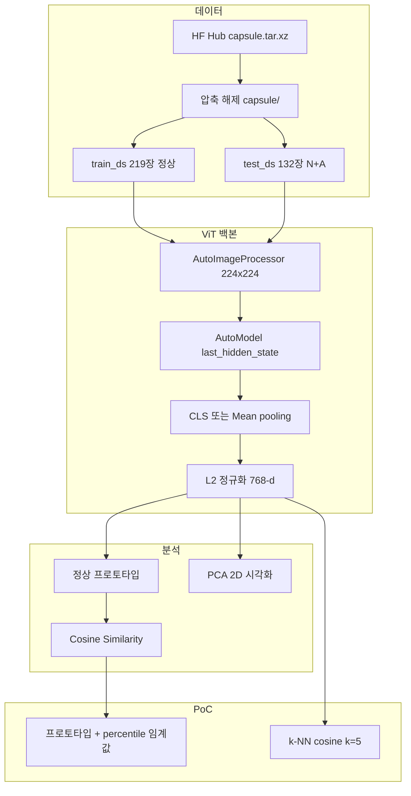
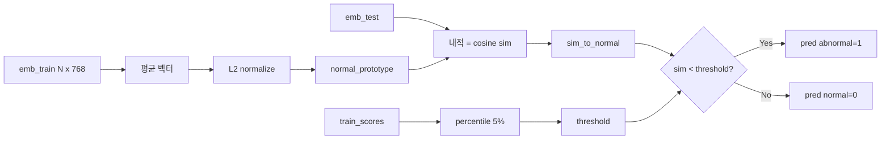

# `08_MVTec_AD_ViT_Defect_Classification_PoC.ipynb` 기능 문서

## 1. 문서 목적

이 문서는 `08_MVTec_AD_ViT_Defect_Classification_PoC.ipynb`에 구현된 **산업용 이미지 이상 탐지 PoC(Proof of Concept)** 코드의 기능·알고리즘·데이터 흐름·함수 명세를 상세히 설명합니다.

노트북의 핵심 목표는 다음과 같습니다.

- **MVTec AD** 벤치마크의 capsule(캡슐) 카테고리로 제품 이미지를 로드한다.
- HuggingFace **ViT**(Vision Transformer) 사전학습 모델로 **이미지 임베딩**을 추출한다.
- **Cosine Similarity**로 정상 표현(프로토타입)과의 유사도를 분석한다.
- **비지도 이상 탐지** 시나리오에 맞춰 정상/불량을 구분하는 두 가지 PoC를 구현한다.
  - PoC ①: 정상 프로토타입 + percentile 임계값
  - PoC ②: k-NN 메모리( train 정상 임베딩만 사용)

> **PoC(Proof of Concept)**  
> 실제 서비스 배포 전, “이 기술 조합으로 불량 탐지가 가능한지”를 소규모 데이터·간단한 파이프라인으로 검증하는 실험입니다.

---

## 2. 전체 구성 요약

| 섹션 | 제목 | 주요 내용 | 산출물 |
|------|------|-----------|--------|
| 1 | 환경 설정 | Colab/로컬 감지, 패키지, import, GPU, 한글 폰트 | `device`, `IN_COLAB`, `RNG` |
| 2 | MVTec AD 로드 | Hub archive 다운로드·압축 해제·Dataset 구성 | `train_ds`, `test_ds` |
| 2-1 | 샘플 시각화 | train/test 그리드 | matplotlib figure |
| 3 | ViT 로드 | `google/vit-base-patch16-224` | `processor`, `model` |
| 4 | Image Embedding | CLS/Mean pooling, 배치 인코딩 | `encode_*` 함수 |
| 5 | 임베딩 생성 | train/test 전체 임베딩 | `emb_train`, `emb_test` |
| 6 | Similarity 분석 | 프로토타입 유사도, 히트맵, PCA | `sim_to_normal`, 시각화 |
| 7 | PoC ① | 프로토타입 이상 탐지 + ROC | `pred_proto`, AUC |
| 8 | PoC ② | k-NN 메모리 이상 탐지 | `pred_knn`, confusion matrix |
| 9 | Pooling 비교 | CLS vs Mean ROC-AUC | `results` |
| 10 | (선택) Colab 업로드 | 단일 이미지 점수 | `verdict` |
| 11 | 정리 | 확장 방향 | — |



---

## 3. 문제 정의 및 MVTec AD 시나리오

### 3.1 산업 이상 탐지(Anomaly Detection) 관점

MVTec AD는 **제조 검사** 맥락의 표준 벤치마크입니다. 본 노트북은 다음 **비지도** 가정을 따릅니다.

| 가정 | 설명 |
|------|------|
| train | **정상(normal) 이미지만** 제공 |
| test | 정상 + **불량(abnormal)** 혼합 |
| 목표 | train에 없던 결함 패턴을 test에서 **탐지** |

불량 **유형 분류**(scratch, crack 등)는 하지 않고, 이진 라벨 `normal(0)` / `abnormal(1)` 만 사용합니다.

### 3.2 Capsule 카테고리 통계 (본 PoC 기준)

| Split | 장수 | 라벨 구성 |
|-------|------|-----------|
| `train` | 219 | 전부 정상 (`good`) |
| `test` | 132 | 정상 23 + 불량 109 |

불량 test 이미지는 `capsule/test/<결함유형>/` 하위에 있으며, 폴더명이 `good`이 아니면 `label=1`로 매핑됩니다.

### 3.3 ViT를 쓰는 이유 (노트북 설계 의도)

- ImageNet 사전학습 ViT는 **일반적인 시각 특징**을 768차원 벡터로 압축한다.
- **Fine-tuning 없이** 임베딩 + 유사도만으로 PoC를 빠르게 검증할 수 있다.
- 이후 확장: 동일 백본에 Linear Probe, 도메인 Fine-tuning, Anomalib(PatchCore) 비교 등.

---

## 4. 의존성 및 실행 환경

### 4.1 권장 패키지

| 패키지 | 용도 |
|--------|------|
| `torch` | ViT 추론, 텐서 연산 |
| `transformers` | `AutoImageProcessor`, `AutoModel` |
| `datasets` | `Dataset`, `Features`, `ClassLabel` |
| `huggingface_hub` | `hf_hub_download` (archive 직접 다운로드) |
| `PIL` | 이미지 I/O |
| `numpy` | 라벨·통계 |
| `sklearn` | PCA, k-NN, metrics |
| `matplotlib`, `seaborn` | 시각화 |

로컬 설치 예시 (노트북 주석):

```bash
py -3.11 -m pip install transformers datasets scikit-learn pillow matplotlib seaborn huggingface_hub
```

### 4.2 실행 환경 감지 (`IN_COLAB`)

```python
try:
    import google.colab
    IN_COLAB = True
except ImportError:
    IN_COLAB = False
```

- Colab: `%pip install` 셀 사용 가능(현재 노트북에서는 주석 처리됨).
- 로컬: 사전 설치 후 Jupyter 실행.

### 4.3 디바이스·재현성

| 변수 | 값 | 설명 |
|------|-----|------|
| `device` | `cuda` 또는 `cpu` | ViT 추론 디바이스 |
| `RNG` | `np.random.default_rng(42)` | test 서브셋 샘플링 등 |
| `torch.manual_seed(42)` | — | PyTorch 시드 |

### 4.4 한글 폰트 (`setup_korean_font`)

matplotlib 그래프 제목·축 라벨 한글 깨짐 방지. 우선순위:

`Malgun Gothic` → `AppleGothic` → `NanumGothic` → … → 없으면 `DejaVu Sans`.

`axes.unicode_minus = False` 로 마이너스 기호 깨짐 방지.

### 4.5 import 이름 충돌 주의

```python
from datasets import Image as HFImage   # HuggingFace Dataset Image feature
from PIL import Image                   # PIL 이미지 클래스
```

`datasets.Image`와 `PIL.Image`를 동시에 `Image`로 import하면 **`Image()` 호출 시 TypeError**가 납니다.  
데이터셋 feature 정의에는 반드시 `HFImage()`를 사용합니다.

### 4.6 Hugging Face Hub 경고

`HF_TOKEN` 미설정 시:

> Warning: You are sending unauthenticated requests to the HF Hub...

- 다운로드는 가능하나 rate limit이 낮을 수 있음.
- 토큰 설정: [https://huggingface.co/settings/tokens](https://huggingface.co/settings/tokens) → 환경 변수 `HF_TOKEN`.

---

## 5. 섹션 2 — MVTec AD 데이터 로드

### 5.1 왜 `load_dataset()`을 쓰지 않는가

Hub 저장소 `alexsu52/mvtec_capsule`에는 레거시 로딩 스크립트 `mvtec_capsule.py`가 있습니다.  
**`datasets` 4.x**부터 Hub Python 스크립트 실행이 금지되어 다음 오류가 발생합니다.

```text
RuntimeError: Dataset scripts are no longer supported, but found mvtec_capsule.py
```

또한 해당 repo에는 Parquet 변환 브랜치(`refs/convert/parquet`)가 없습니다.

**대안:** Hub에 있는 `capsule.tar.xz`(약 404MB)만 다운로드하고, 원본 스크립트와 동일한 규칙으로 `Dataset`을 직접 구성합니다.

### 5.2 상수

| 이름 | 값 | 설명 |
|------|-----|------|
| `MVTEC_HF_ID` | `alexsu52/mvtec_capsule` | Hub dataset repo |
| `MVTEC_ARCHIVE` | `capsule.tar.xz` | 아카이브 파일명 |
| `LABEL_NAMES` | `{0: 'normal', 1: 'abnormal'}` | 표시용 라벨명 |

### 5.3 디렉터리 구조 (압축 해제 후)

```text
mvtec_capsule_extracted/
└── capsule/
    ├── train/
    │   └── good/          ← 정상 학습 이미지
    ├── test/
    │   ├── good/          ← test 정상
    │   ├── crack/         ← 결함 유형별 폴더 (예시)
    │   ├── scratch/
    │   └── ...
    └── ground_truth/      ← test 불량에 대응하는 마스크 PNG
        └── <결함유형>/
```

노트북 PoC는 **RGB 이미지 + 이진 라벨**만 사용하며, `ground_truth` 마스크는 **로더에서 정합성 검증**만 하고 분류 파이프라인에는 넣지 않습니다.

### 5.4 함수 `load_mvtec_capsule`

```python
def load_mvtec_capsule(repo_id: str = MVTEC_HF_ID) -> dict[str, Dataset]
```

#### 처리 단계

1. **`hf_hub_download`**  
   - `repo_type='dataset'`, `filename='capsule.tar.xz'`  
   - 캐시 경로 예: `%USERPROFILE%\.cache\huggingface\hub\...`

2. **압축 해제 (1회)**  
   - `extract_dir = Path(archive_path).parent / 'mvtec_capsule_extracted'`  
   - `category_dir = extract_dir / 'capsule'` 가 없을 때만 `tarfile.extractall`

3. **`_split_records(split_name)`** — 이미지 목록·라벨 생성  
   - `category_dir.rglob('*.png')` 로 모든 PNG 탐색  
   - 상대 경로 `rel.parts` 길이가 3이어야 함: `(split, defect_label, filename)`  
   - `split == 'ground_truth'` → `masks` 리스트에 경로만 저장  
   - 그 외: `label = 0` if `defect_label == 'good'` else `1`  
   - test 불량(`label==1`)과 `masks`를 **정렬 후 1:1 매칭** 검증  
     - 개수 불일치 → `RuntimeError`  
     - 파일 stem 불일치 → `RuntimeError` (마스크-이미지 이름 규칙 위반)  
   - 요청 split(`train` / `test`)만 `{'image': path, 'label': int}` 로 반환

4. **`Dataset.from_list`**  
   - Features: `image: HFImage()`, `label: ClassLabel(['normal','abnormal'])`  
   - 접근 시 `row['image']`는 PIL Image로 디코딩됨

#### 반환값

```python
{
    'train': Dataset,  # 219 rows
    'test': Dataset,   # 132 rows
}
```

### 5.5 Windows 캐시 symlink 경고

symlink 미지원 시 `huggingface_hub`가 경고를 냅니다. 동작에는 문제 없으나 디스크 사용량이 늘 수 있습니다.  
비활성화: 환경 변수 `HF_HUB_DISABLE_SYMLINKS_WARNING=1`.

---

## 6. 섹션 2-1 — 샘플 시각화

### 6.1 `hf_row_to_pil(row) -> Image.Image`

| 입력 | 처리 |
|------|------|
| `row['image']`가 PIL | `convert('RGB')` |
| 그 외 (ndarray 등) | `Image.fromarray(np.asarray(img)).convert('RGB')` |

ViT processor는 RGB PIL 리스트를 받습니다.

### 6.2 `show_mvtec_grid(rows, title, ncols=6)`

- 최대 `ncols`장 가로 배열 subplot  
- 제목: `LABEL_NAMES[label]` 또는 train은 `'train'`  
- **실행 예:** train 6장, test 정상 3 + 불량 3

---

## 7. 섹션 3 — ViT 모델 로드

### 7.1 모델 사양

| 항목 | 값 |
|------|-----|
| `MODEL_NAME` | `google/vit-base-patch16-224` |
| 입력 해상도 | 224×224 (패치 16×16) |
| 패치 수 | 14×14 = **196** |
| 시퀀스 길이 | 1 (CLS) + 196 = **197** |
| `hidden_size` | **768** |
| 사전학습 | ImageNet-21k → ImageNet-1k (분류 헤드는 제거하고 `AutoModel`만 사용) |

### 7.2 로드 코드

```python
processor = AutoImageProcessor.from_pretrained(MODEL_NAME)
model = AutoModel.from_pretrained(MODEL_NAME).to(device)
model.eval()
```

- `BATCH_SIZE = 16` — VRAM에 맞게 조절 가능  
- 추론 시 `@torch.no_grad()` 로 gradient 비활성화

### 7.3 Processor가 하는 일 (요약)

- 리사이즈·센터 크롭(모델 config 기준)  
- 픽셀 정규화 (ImageNet mean/std)  
- `pixel_values` 텐서 `[B, 3, 224, 224]` 생성

---

## 8. 섹션 4 — Image Embedding

### 8.1 Pooling 전략

`PoolingStrategy = Literal['cls', 'mean']`

| strategy | 수식/구현 | 의미 |
|----------|-----------|------|
| `cls` | `hidden_state[:, 0, :]` | **[CLS] 토큰** — ViT 분류기와 동일한 전역 표현 |
| `mean` | `hidden_state[:, 1:, :].mean(dim=1)` | **패치 토큰 평균** — 공간 정보를 균등 집계 |

입력 텐서 shape: `[batch, 197, 768]` → 출력: `[batch, 768]`.

### 8.2 L2 정규화

```python
emb = F.normalize(emb, p=2, dim=-1)
```

Cosine Similarity를 **내적(dot product)** 만으로 계산하기 위함:

\[
\cos(a, b) = \frac{a \cdot b}{\|a\|\|b\|} = a \cdot b \quad (\|a\|=\|b\|=1)
\]

### 8.3 `pool_hidden_state(hidden_state, strategy)`

- 지원하지 않는 strategy → `ValueError`

### 8.4 `encode_pil_batch(images, strategy='cls', normalize=True)`

| 단계 | 설명 |
|------|------|
| 1 | `processor(images=..., return_tensors='pt')` |
| 2 | GPU/CPU 이동 |
| 3 | `model(**inputs)` → `last_hidden_state` |
| 4 | pooling + 선택적 L2 normalize |
| 5 | `.cpu()` 반환 `[B, 768]` |

### 8.5 `encode_hf_split(split, strategy, batch_size, max_samples=None)`

전체 HuggingFace `Dataset` split을 임베딩합니다.

| 파라미터 | 설명 |
|----------|------|
| `split` | `train_ds` 또는 `test_ds` |
| `max_samples` | 앞에서부터 N장만 처리 (디버그용) |
| `batch_size` | 기본 `BATCH_SIZE`(16) |

**라벨 처리:**

- `split.features`에 `label` 있으면 → 각 행의 `int(label)` 수집  
- 없으면 → 전부 `0` (train-only 정상 가정)

**반환:** `(embeddings: Tensor [N,768], labels: ndarray [N])`

---

## 9. 섹션 5 — Train / Test 임베딩 생성

```python
POOLING = 'cls'
emb_train, y_train = encode_hf_split(train_ds, strategy=POOLING)
emb_test, y_test = encode_hf_split(test_ds, strategy=POOLING)
```

| 텐서 | shape | 비고 |
|------|-------|------|
| `emb_train` | `[219, 768]` | train은 모두 정상, `y_train`은 0 |
| `emb_test` | `[132, 768]` | `y_test`에 0/1 혼합 |

**소요 시간:** GPU 기준 수 분 이내(모델 최초 다운로드 제외). CPU는 더 김.

---

## 10. 섹션 6 — Cosine Similarity 분석

### 10.1 유틸 함수

#### `cosine_similarity_matrix(embeddings)`

- 입력: L2 정규화된 `[N, D]`  
- 출력: `[N, N]` — `embeddings @ embeddings.T`

#### `cosine_similarity(a, b)`

- 스칼라 1쌍 유사도 (`F.cosine_similarity`)

### 10.2 정상 프로토타입 (Normal Prototype)

```python
normal_prototype = F.normalize(emb_train.mean(dim=0, keepdim=True), p=2, dim=-1)[0]
sim_to_normal = (emb_test @ normal_prototype).numpy()
```

| 개념 | 설명 |
|------|------|
| 프로토타입 | train **정상 임베딩의 평균 벡터** 후 L2 정규화 |
| `sim_to_normal[i]` | test i번째 이미지가 “정상 군집 중심”과 얼마나 비슷한지 |
| 기대 패턴 | 불량은 대체로 **유사도 낮음**, test 정상은 **높음** |

### 10.3 시각화 1 — 유사도 히스토그램

- x축: `sim_to_normal`  
- test normal / abnormal 별도 히스토그램 (색: 녹색/빨강)

### 10.4 시각화 2 — 소규모 유사도 히트맵

- `n_show = 24`장 무작위 추출 (`RNG.choice`)  
- 24×24 cosine matrix, tick은 N/A (normal/abnormal 첫 글자)

### 10.5 시각화 3 — PCA 2D

```python
combined = cat(emb_train, emb_test)
combined_labels = [-1 for train] + y_test
coords = PCA(n_components=2).fit_transform(combined)
```

| 점 군집 | 색 | 의미 |
|---------|-----|------|
| train | 파랑 | 학습 정상 분포 |
| test normal | 녹색 | test 정상 |
| test abnormal | 빨강 | test 불량 |

train 라벨 `-1`은 범례에서 “학습 정상”으로만 구분.

---

## 11. 섹션 7 — PoC ① 정상 프로토타입 이상 탐지

### 11.1 알고리즘



1. **정상 점수:** test(및 train) 임베딩과 프로토타입의 cosine similarity  
2. **임계값:** train 정상 점수 분포의 **하위 `THRESHOLD_PERCENTILE`(5)%**  
   - `threshold = np.percentile(train_scores, 5)`  
   - “train 정상 중 가장 낮은 5% 유사도”보다 더 낮으면 이상으로 간주  
3. **예측:** `pred_proto = (sim_to_normal < threshold).astype(int64)`

### 11.2 평가 지표

| 지표 | 입력 | 해석 |
|------|------|------|
| `accuracy_score` | `y_test`, `pred_proto` | 전체 정확도 |
| `roc_auc_score(y_test, -sim_to_normal)` | 점수 = **−유사도** | 유사도↓ → 불량 가능성↑ 이므로 부호 반전 |
| `classification_report` | precision/recall/F1 | 클래스별 |

### 11.3 ROC 곡선 셀

- `fpr, tpr, _ = roc_curve(y_test, -sim_to_normal)`  
- 대각선 점선: random classifier

### 11.4 설계상 주의점

- 임계값을 **test 라벨로 튜닝하지 않음** — train 분포만 사용 (비지도에 가까움)  
- 실무에서는 검증용 정상 세트·운영 로그로 percentile 재조정 필요  
- capsule test는 **불량 비율이 높음**(109/132) — accuracy만으로는 오해 가능, **ROC-AUC** 병행 권장

---

## 12. 섹션 8 — PoC ② k-NN 메모리 이상 탐지

### 12.1 알고리즘

| 항목 | 설정 |
|------|------|
| 메모리 | `emb_train` (219장, 전부 정상) |
| k | `K_NEIGHBORS = 5` |
| 거리 | `metric='cosine'` (sklearn) |
| 분류기 | `KNeighborsClassifier` — **fit 라벨은 전부 0**(형식상); 예측 클래스는 사용하지 않음 |

**점수 정의:**

```python
distances, _ = knn_mem.kneighbors(emb_test.numpy())
knn_scores = 1.0 - distances.mean(axis=1)
```

- sklearn cosine **distance** = 1 − cosine similarity (이웃 기준)  
- k개 이웃 distance 평균 → `1 - mean` = **평균 cosine similarity**  
- **높을수록 정상**, 낮을수록 불량 후보

**임계값:**

```python
knn_train_scores = 1.0 - knn_mem.kneighbors(emb_train)[0].mean(axis=1)
knn_threshold = np.percentile(knn_train_scores, THRESHOLD_PERCENTILE)  # 동일 5%
pred_knn = (knn_scores < knn_threshold).astype(int64)
```

### 12.2 PoC ①과의 차이

| | PoC ① 프로토타입 | PoC ② k-NN |
|--|------------------|------------|
| 정상 표현 | 단일 평균 벡터 | 219개 메모리 점 |
| 민감도 | 전역 중심만 | 국소 이웃 구조 반영 |
| 계산 | O(N) 내적 | O(N·k) 이웃 검색 |
| 라벨 누수 | 없음 (train 정상만) | 없음 |

### 12.3 Confusion Matrix

- `sns.heatmap` — 행 true, 열 pred (`pred N` / `pred A`)

---

## 13. 섹션 9 — Pooling 방식 비교

```python
for strategy in ['cls', 'mean']:
    e_tr, _ = encode_hf_split(train_ds, strategy=strategy)
    e_te, y_te = encode_hf_split(test_ds, strategy=strategy)
    proto = F.normalize(e_tr.mean(dim=0, keepdim=True), p=2, dim=-1)[0]
    scores = (e_te @ proto).numpy()
    auc = roc_auc_score(y_te, -scores)
```

- **동일 파이프라인**으로 CLS vs Mean의 **프로토타입 ROC-AUC** 만 비교  
- `best` — AUC 최대 strategy 출력  
- 전체 train/test를 **두 번씩** ViT forward 하므로 시간 2배

---

## 14. 섹션 10 — (선택) Colab 단일 이미지 업로드

`IN_COLAB == True` 일 때만:

1. `google.colab.files.upload()`  
2. 업로드 바이트 → `Image.open(io.BytesIO(data))`  
3. `encode_pil_batch` → `emb @ normal_prototype`  
4. PoC ①과 **동일 `threshold`** 로 `normal` / `abnormal` 출력  
5. 이미지 + 제목 표시

로컬에서는 동일하게:

```python
img = Image.open('path/to/image.png').convert('RGB')
emb = encode_pil_batch([img], strategy=POOLING)[0]
score = float(emb @ normal_prototype)
```

---

## 15. 전역 변수·하이퍼파라미터 일람

| 이름 | 기본값 | 섹션 | 설명 |
|------|--------|------|------|
| `MODEL_NAME` | `google/vit-base-patch16-224` | 3 | ViT 백본 |
| `BATCH_SIZE` | 16 | 3–5 | 인코딩 배치 |
| `POOLING` | `'cls'` | 5–10 | 기본 pooling |
| `THRESHOLD_PERCENTILE` | 5 | 7–8 | train 정상 점수 하위 % |
| `K_NEIGHBORS` | 5 | 8 | k-NN k |
| `n_show` | 24 | 6 | 히트맵 샘플 수 |
| `RNG` seed | 42 | 4, 6 | 재현성 |

---

## 16. 셀 실행 순서 (권장)

1. 환경 감지 (섹션 1)  
2. (필요 시) 패키지 설치  
3. import · device · 폰트 · seed  
4. `load_mvtec_capsule` — **첫 실행 시 400MB+ 다운로드**  
5. 샘플 그리드 (선택)  
6. ViT 로드 — **첫 실행 시 모델 가중치 다운로드**  
7. Pooling 함수 정의  
8. `emb_train` / `emb_test` 생성  
9. Similarity · PCA 시각화  
10. PoC ① → ROC  
11. PoC ② → confusion matrix  
12. Pooling 비교 (선택, ViT 재추론)  
13. Colab 업로드 (해당 시만)

이전 셀 변수에 의존하므로 **위에서부터 순차 실행**이 필요합니다.

---

## 17. 트러블슈팅

| 증상 | 원인 | 조치 |
|------|------|------|
| `Dataset scripts are no longer supported` | `load_dataset` 사용 | 본 노트북의 `load_mvtec_capsule` 사용 (이미 반영) |
| `TypeError: 'module' object is not callable` at `Image()` | PIL/datasets `Image` 충돌 | `HFImage()` 사용 (이미 반영) |
| `KeyError: 'split'` in `from_list` | feature에 없는 키 포함 | `image`, `label`만 반환 (이미 반영) |
| HF unauthenticated warning | `HF_TOKEN` 없음 | 토큰 설정 또는 무시 |
| CUDA OOM | 배치过大 | `BATCH_SIZE` 감소 |
| 한글 깨짐 | 폰트 없음 | `setup_korean_font` 또는 OS 폰트 설치 |
| Colab 업로드 셀 미동작 | 로컬 실행 | PIL 경로로 `encode_pil_batch` 호출 |

---

## 18. 한계 및 실무 확장 (노트북 정리 셀 기준)

### 18.1 본 PoC의 한계

- **카테고리 1개**(capsule)만 사용 — 다른 MVTec 객체 일반화 미검증  
- **이진 탐지** — 결함 유형·위치(세그멘테이션) 미제공  
- ViT는 **ImageNet 도메인** — 공장 조명·각도 차이에 취약할 수 있음  
- test 불량 비율이 높아 **운영 불균형**과 다를 수 있음  
- 임계값 5 percentile은 **예시**이며 데이터·라인별 튜닝 필요

### 18.2 문서화된 다음 단계

| 방향 | 설명 |
|------|------|
| 결함 유형 분류 | 예: `TheoM55/mvtec_all_objects_split` 의 `defect` 컬럼 |
| 도메인 적응 | ViT + Linear Probe / Fine-tuning |
| SOTA 비교 | Anomalib PatchCore 등과 AUC·속도 비교 |
| Hub 데이터셋 | Parquet 변환 또는 archive 로더 유지 |

---

## 19. 참고 링크

- [MVTec AD Dataset](https://www.mvtec.com/company/research/datasets/mvtec-ad)
- [HuggingFace alexsu52/mvtec_capsule](https://huggingface.co/datasets/alexsu52/mvtec_capsule)
- [google/vit-base-patch16-224](https://huggingface.co/google/vit-base-patch16-224)
- [MVTec AD 논문 (Springer)](https://link.springer.com/article/10.1007/s11263-020-01400-4)

---

## 20. 부록 — 함수·변수 빠른 참조

| 심볼 | 타입 | 역할 |
|------|------|------|
| `IN_COLAB` | bool | Colab 여부 |
| `device` | `torch.device` | 연산 디바이스 |
| `load_mvtec_capsule` | function | archive → Dataset dict |
| `hf_row_to_pil` | function | Dataset row → PIL RGB |
| `show_mvtec_grid` | function | 이미지 그리드 표시 |
| `pool_hidden_state` | function | CLS/Mean pooling |
| `encode_pil_batch` | function | PIL 리스트 → 임베딩 |
| `encode_hf_split` | function | Dataset split → 임베딩+라벨 |
| `cosine_similarity_matrix` | function | N×N 유사도 |
| `cosine_similarity` | function | 1쌍 유사도 |
| `normal_prototype` | Tensor [768] | 정상 중심 벡터 |
| `sim_to_normal` | ndarray [132] | test 유사도 |
| `threshold` | float | PoC① 임계값 |
| `pred_proto` | ndarray | PoC① 예측 |
| `knn_mem` | KNeighborsClassifier | PoC② 메모리 |
| `knn_scores` | ndarray | PoC② 점수 |
| `pred_knn` | ndarray | PoC② 예측 |

---

*문서 버전: 노트북 `08_MVTec_AD_ViT_Defect_Classification_PoC.ipynb` 기준 (datasets 4.x + `load_mvtec_capsule` + `HFImage` 별칭 반영)*
